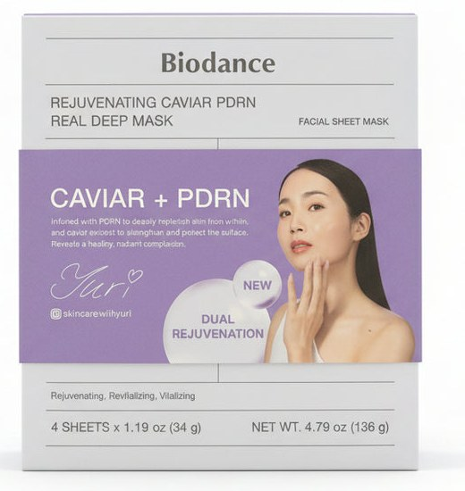
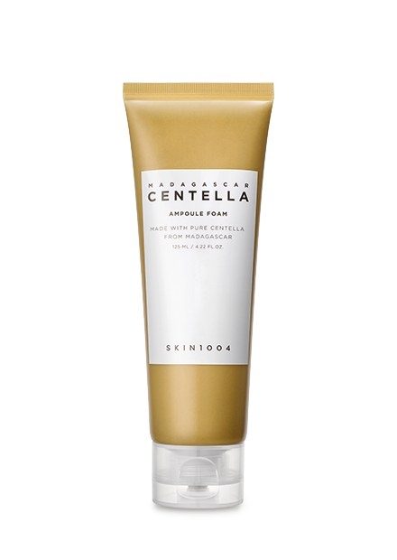
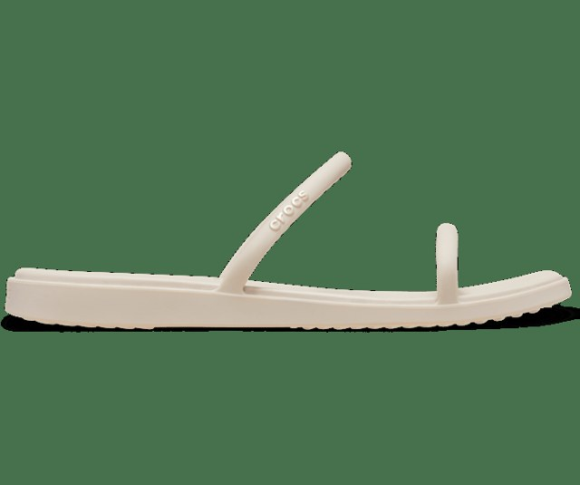

# 2026 釜山親子旅行手冊

**旅期**：2026/09/13 - 2026/09/20  
**成員**：2 位大人 + 1 位 2 歲幼童  
**旅行節奏**：每天保留午休、少拖行李、晚上盡量 21:00 前回飯店  

---

## 旅行重點

- 有幼童與行李時，換飯店日優先處理行李，再開始玩。
- 海雲台、南浦、松島、沙上各自成區，不要同一天來回拉太遠。
- 9/16 只搶到清沙浦 14:00 這班膠囊列車；早餐後先在飯店旁的海雲台沙灘玩，回飯店洗漱再搭海岸列車直達清沙浦，膠囊列車回尾浦後吃極東豬肉湯飯，下午午睡。不去松亭。
- 9/17 退房後 Uber 直達 El Momento Songdo 寄行李，趁晴天先搭松島纜車、走雲橋，午餐後計程車到南浦（國際市場、光復路、aery、樂天超市、海豚豆腐鍋、釜山塔），19:45 回松島入住；9/18 雨天：南浦室內（追憶寶物島、豚笑午餐）＋松島休息。太宗台、Club D Oasis 都不去了。
- 9/19 是回國前一晚，定位為沙上休息與採買日。
- 9/20 從沙上搭釜山-金海輕軌到機場，路線短又穩。

## 住宿安排

| 日期 | 住宿 | 地址 / 叫車定位用 | 訂房平台 | 早餐 | 洗衣 | 入住 / 退房 |
|---|---|---|---|---|---|---|
| 9/13-9/14 | Hotel Kyungsung | 26, Seomyeonmunhwa-ro, Busanjin-gu, Busan 47256 | Booking.com | 無 | 無洗衣機（官網 Q&A） | 16:00～24:00／11:00 前 |
| 9/15-9/16 | UH Continental CenterPoint | 2-21, Dalmaji-gil, Haeundae-gu, Busan 48099 | 易遊網 | 含早餐（9/16、9/17 早上） | 洗衣服務（平台列免費，無自助機，問櫃檯） | 15:00 後／11:00 前 |
| 9/17-9/18 | Elmomento Songdo | 9, Deungdae-ro, Seo-gu, Busan 49263 | Agoda | 無 | 🧺 房內洗衣機（可烘） | 16:00 後／11:00 前 |
| 9/19 | Elmomento Sasang Residence | 20, Saebyeok-ro 223beon-gil, Sasang-gu, Busan 46972（TheStayIaan） | Agoda | 無 | 🧺 房內洗衣機，不提供洗衣粉、要自備 | 16:00 後／11:00 前 |

- UH Continental 館內設施（官網 2026/9 查證）：4F Book&Barrel Lounge 10:00–25:00 是房客專用空間（房價已含，可去看書），**免費的威士忌／Highball／小點只在「威士忌時光」19:00–23:00**，其餘時段官網另掛付費菜單、要點就自費；需成人證件，人多會等；3F Wonder Lounge 兒童空間 09:00–20:00（8 歲以下、需大人陪同，活動預約制）；2F Casual Lounge 10:30–22:00，目前是 12:00–13:00 野餐飯捲課（6 組、需預約）。網路上流傳的「小孩免費可麗餅時間」官網現在沒有列，可能已換活動，check-in 時直接問。
- 洗衣策略：前 4 晚沒有自助洗衣機，9/17 起兩間 Elmomento 房內都有——衣物帶 4 天份就夠，洗衣粉自備旅行包。

- 入住/退房日期以住宿平台顯示的訂單為準：Hotel Kyungsung 9/13 入住、9/15 退房；UH Continental 9/15 入住、9/17 退房；Elmomento Songdo 9/17 入住、9/19 退房；Elmomento Sasang Residence 9/19 入住、9/20 退房。四間退房時間都是 11:00 前。

## 航班資訊

| 航段 | 日期 | 航班 | 機型 / 艙等 | 起飛 | 抵達 | 飛行時間 |
|---|---|---|---|---|---|---|
| 台北 → 釜山 | 9/13（日） | BX794 釜山航空 | 空中巴士 A321・經濟艙 H | TPE 桃園國際機場 T2 13:30 | PUS 釜山金海機場 17:05 | 2h35m |
| 釜山 → 台北 | 9/20（日） | BX793 釜山航空 | 空中巴士 A321・經濟艙 U | PUS 釜山金海機場 10:50 | TPE 桃園國際機場 T2 12:35 | 2h45m |

## 釜山 PASS 購買建議

**已選 BIG5 方案**（每人 65,000 韓元，選 2 個紫組＋3 個藍組，啟用後 180 天內有效，適合景點分散在不連續幾天的行程；比 24H/48H 時限型划算，因為這幾個景點分布在 Day3、Day4、Day6，時限型要買兩張才夠用）：

| 分組 | 用 PASS 的景點 | 單獨買票參考價／人 |
|---|---|---|
| 紫組（2 個） | Skyline Luge、BUSAN X the SKY | 約 28,000 / 27,000 韓元 |
| 藍組（3 個） | 松島海上纜車、釜山塔、松島龍宮雲橋（原排海雲台海灘列車，Day 4 最後改走路沒用到） | 約 17,000 / 12,000 / 1,000 韓元 |

藍組 3 個名額 Day 4 都沒用到（海岸列車那段改成沿海岸散步到청사포），所以 Day 6 松島龍宮雲橋（다릿돌전망대／용궁구름다리，約 1,000 韓元／人，7 歲以下免費）也直接刷 PASS，不用付現。

實際使用組合（Luge、X the SKY、松島纜車、釜山塔、龍宮雲橋）單獨買票約 170,000 韓元／2 大人；BIG5 130,000 韓元，仍省約 40,000 韓元。小孩（2 歲）在這幾個景點大多免費入場，應該不需要幫她另外買一張。

**下單前先綁折價券**：KTO 直飛趣韓國有一張 Visit Busan Pass 折 1,000 韓元的通享券——先在 visitbusanpass.com 註冊會員登入，MY PAGE → 優惠券盒輸入 email 收到的優惠券編號，再買 BIG5 就會折抵（見「KTO 外國人通享券」章節）。

**領卡方式**（官方公告 2026-09-03）：線上買好的卡片版 PASS，9/3 起可在兩台 24 小時自助領卡機領取（中文介面，WOW PASS 代管）：

| 地點 | 位置 | 地址 | 本次用法 |
|---|---|---|---|
| 金海機場（建議） | 國際線 1F 4 號門旁 | 부산광역시 강서구 공항진입로 108 | Day 1 17:05 落地、出關後順路領，約 2 分鐘；同層有釜山觀光諮詢處人工櫃檯可備援 |
| 釜山站（備援） | KTX 釜山站 2F 7 號出口旁 | 부산광역시 동구 중앙대로 206 | 行程不經過釜山站，只在機場機台故障時當備案 |

**PASS 卡就是交通卡**：官方手冊寫明卡片版 Visit Busan Pass 內建可加值的交通卡功能（地鐵、公車皆可，實體卡限定），不用另外買 T-money；領到卡後到地鐵站加值機用現金儲值即可，兩位大人各一張。

流程：掃購買平台的訂單 QR → 機台吐卡 → 再感應卡片背面 QR 完成取卡。領卡**不會**啟用 180 天有效期，第一次在景點刷卡（Day 3 Skyline Luge）才開始算。只有在機台直接購買才需刷護照；上線初期系統可能不穩，刷不過就改人工櫃檯或線上客服（機台問題由 WOW PASS 客服處理）。記得先把訂單 QR 截圖存在手機。

**注意（2026-09-17 更新）**：Day 5 趁晴天把三個藍組一天刷完（上午松島纜車、龍宮雲橋，傍晚釜山塔）；Day 6 雨天只留室內。太宗台、Club D Oasis 都不去；Club D Oasis 是紫組且名額已用完，之後想去要另購票。

## 親子旅行原則

- 上午安排戶外，下午保留室內或午睡。
- 每天至少留一段 60-120 分鐘回飯店休息。
- 餐廳時間可彈性，幼童餓了先便利商店或麵包墊胃。
- 推車可帶，但海東龍宮寺坡與階梯多，必要時改用背巾。
- 每天晚上先整理隔天用品：尿布、濕紙巾、水、點心、釜山 PASS 卡（兼交通卡）、護照。

---

# Day 1 - 9/13（日）出發與抵達釜山

**住宿**：Hotel Kyungsung  
**重點**：穩穩抵達、入住、吃晚餐，不排景點。

| 時間 | 行程 | 停留 | 備註 |
|---|---|---:|---|
| 10:00 | 家裡出發搭車 | 60 分 | 2 大 + 2 歲幼童，提早一點 |
| 11:00 | 抵達機場 / Check in | 90 分 | 托運行李、劃位、整理推車 |
| 12:30 | 機場午餐 / 換尿布 / 登機準備 | 60 分 | 不要排太緊 |
| 13:30 | 搭乘飛機 / 登機 | 215 分 | BX794 釜山航空・A321・經濟艙 H，TPE T2 起飛 |
| 17:05 | 落地 / 領行李 | 70 分 | PUS 釜山金海機場抵達，飛行時間 2h35m |
| 18:15 | 出關 / 簡單補給 | 30 分 | 買水、整理行李；順路到 1F 4 號門旁的釜山 PASS 自助領卡機領卡（掃訂單 QR → 取卡 → 再掃卡背 QR；領卡不會啟用有效期）。交通卡不用另買——PASS 實體卡本身就是可加值的交通卡，到地鐵站加值機用現金儲值即可。換錢在機場輕軌站的換錢所換就夠，匯率差不多，不用專程跑西面／南浦 |
| 18:45 | 搭車到 Hotel Kyungsung | 60 分 | 輕軌+地鐵或行李多搭計程車 |
| 19:45 | Hotel Kyungsung Check in | 30 分 | 放行李、休息一下 |
| 20:15 | 橋村炸雞西面店 / 晚餐宵夜 | 75 分 | 可外帶回飯店 |
| 21:30 | 回飯店整理 / 洗澡 | 30 分 |  |
| 22:00 | 睡覺 |  |  |

**小提醒**：第一天成功標準很簡單：順利入住、吃到東西、小孩洗澡睡覺。

**雨天備案**：全天以機場、交通、飯店為主，沒有戶外行程，下雨不影響。

---

# Day 2 - 9/14（一）西面與田浦輕鬆日

**住宿**：Hotel Kyungsung  
**重點**：市民公園放電、田浦吃喝、西面室內逛街。

| 時間 | 行程 | 停留 | 備註 |
|---|---|---:|---|
| 09:00 | 晨喚 / 早餐 | 60 分 | 飯店附近簡單吃 |
| 10:00 | 釜山市民公園 | 120 分 | 適合幼童放電、散步 |
| 12:00 | 搭車到田浦咖啡街 | 30 分 | 從公園往田浦移動 |
| 12:30 | 田浦咖啡街 / 午餐 / 下午茶 | 120 分 | 咖啡推薦 Pot of Busan（無花果汽水）／FRUTO FRUTA（水果冰沙），順路可逛 object、made by 等選物店，詳見備用景點「選物店」分類 |
| 14:30 | 回飯店午休 | 90 分 | 小孩午睡，爸媽也回血 |
| 16:00 | 樂天百貨 / 西面地下街 | 90 分 | 室內逛街，雨天也 OK |
| 17:30 | ARTBOX / BUTTER | 60 分 | 買小物、文具、玩具 |
| 18:30 | 松亭3代豬肉湯飯 | 90 分 | 晚餐 |
| 20:00 | 回飯店 Hotel Kyungsung |  | 早點休息 |

**備案**：如果下雨，市民公園可縮短，直接改成樂天百貨 + 西面地下街。

**田浦咖啡推薦**（依飲品／甜點是否含蛋標註，網路未列完整過敏原，建議現場再向店員確認）：
- Pot of Busan（부산 부산진구 전포대로209번길 26）：老宅咖啡廳，氣氛靜謐；必點無花果汽水，飲品類天然無蛋
- FRUTO FRUTA（부산 부산진구 전포대로224번길 28）：水果為主題，當季水蜜桃／芒果冰沙，飲品類天然無蛋
- Strut Coffee（부산 부산진구 동성로39번길 28）：2025 世界百大咖啡店，老屋改建、主打單品咖啡，甜點選項少
- fm coffee（부산 부산진구 전포대로199번길 26 1층）：水果派人氣店（草莓派／葡萄派），派皮通常含蛋，需現場確認

**田浦選物店推薦**（小清新風格文創選物）：
- object西面店（부산 부산진구 전포대로209번길 11）：文創選物指標店，杯盤餐具、吊飾、DIY 鑰匙圈，店面大好逛
- made by 西面店（부산 부산진구 전포대로199번길 34）：文具貼紙控必逛，手帳本、紙膠帶款式多
- AVIVERE Company（부산 부산진구 동천로 66 1층）：質感餐具、髮飾、鞋包，價格親民
- Slow Museum（부산 부산진구 서전로58번길 9 1층）：日系質感髮圈與飾品，氣氛優雅
- Stellaria／별꽃상점（부산 부산진구 전포대로 207 1층）：色彩繽紛選物店，餐具、娃娃、襪子款式特別

---

# Day 3 - 9/15（二）換飯店、龍宮寺、Luge

**住宿**：UH Continental 中心點酒店  
**重點**：先寄行李再往機張玩，傍晚回飯店午休。

| 時間 | 行程 | 停留 | 備註 |
|---|---|---:|---|
| 08:30 | 晨喚 / 整理行李 | 60 分 | Hotel Kyungsung 退房準備 |
| 09:30 | 搭車到 UH Continental | 40 分 | 先去海雲台寄放行李 |
| 10:10 | UH Continental 寄放行李 | 20 分 | 若不能 check-in，先寄放 |
| 10:30 | 搭車到海東龍宮寺 | 45 分 | 建議計程車 |
| 11:15 | 海東龍宮寺 | 90 分 | 樓梯多，慢慢走 |
| 12:45 | 고슬고슬가마솥밥 기장본점午餐 | 75 分 | 釜飯，有包廂＋海景，適合帶小孩安靜吃飯 |
| 14:00 | Skyline Luge 斜坡滑車 | 120 分 | 滿 85cm 可與大人共乘（另購 doubling ticket）；未滿 85cm 不能搭 |
| 16:00 | 搭車回 UH Continental | 40 分 | Osiria 回海雲台，小孩常在車上先睡著 |
| 16:40 | Check in / 午休補眠 | 100 分 | 當安靜休息時段，爸媽輪流整理行李 |
| 18:20 | 海雲台附近晚餐 | 90 分 | 不建議再拉遠 |
| 19:50 | 回飯店休息 |  | UH Continental；小孩睡了大人可輪流上 4F Book&Barrel Lounge——威士忌時光 19:00-23:00 免費（威士忌／Highball／小點，房價已含，需出示成人證件） |

**親子提醒**：Luge 未滿 85cm 不能搭，改樂天 Outlet 或飯店休息。體力有餘可加 Museum 1（Centum City，檔期至 2026/10/11，最後入場為閉館前 1 小時）。

**雨天備案**：龍宮寺可撐傘走，但階梯濕滑要放慢；Skyline Luge 官方僅雷雨／豪雨／颱風才會臨時關閉，小雨通常正常運行、只是賽道較滑，出發前看官網公告確認，若確定關閉改去國立釜山科學館（機張，室內親子景點）或樂天 Outlet 東釜山。

---

# Day 4 - 9/16（三）海雲台沙灘、海岸列車、膠囊列車、夜景

**住宿**：UH Continental 中心點酒店  
**重點**：早餐後先在飯店旁的海雲台沙灘挖沙，回飯店洗漱再搭海岸列車到清沙浦散步、咖啡廳輕食，14:00 膠囊列車回尾浦吃極東豬肉湯飯，下午午睡、傍晚夕陽夜景。

| 時間 | 行程 | 停留 | 備註 |
|---|---|---:|---|
| 08:00 | 晨喚 | 30 分 | 今天唯一的固定點是 14:00 膠囊列車，早上先趁涼去沙灘 |
| 08:30 | 飯店早餐 | 30 分 | UH Continental 這天含早餐；吃快一點，早上沙灘涼又人少 |
| 09:00 | 海雲台沙灘 / 挖沙 | 105 分 | 飯店旁就是沙灘，走下去就到；早上不熱、人少，玩沙用品直接帶下去。今天不去松亭，可以玩久一點 |
| 10:45 | 回飯店洗漱 / 換衣 / 小孩吃點東西 | 60 分 | 沖掉沙、換乾衣服、補防曬，玩沙用品收好；正餐要到 14:30 才吃，先讓小孩吃點麵包、點心墊胃 |
| 11:45 | 走到尾浦站 | 20 分 | 飯店在달맞이길上，走到尾浦站不遠 |
| 12:05 | 搭海岸列車到清沙浦 | 15 分 | 尾浦→清沙浦約 12 分，用釜山 PASS 不用另外付費；今天不搭到松亭。（實際：這段改成沿海岸步道散步到청사포，PASS 沒刷，藍組 3 個名額都還在） |
| 12:20 | 청사포항 / 다릿돌전망대 / 咖啡廳輕食 | 70 分 | 先走天空步道看海、拍鐵道，再到 DIART Coffee 或 Liberta 坐下，吐司麵包給小孩墊胃；청사포其他店幾乎全是海鮮，不要進 |
| 13:30 | 清沙浦站月台排隊 | 30 分 | 自由座先搶先贏，面海長椅坐第一排視野最好；提早排隊小小孩才坐得住 |
| 14:00 | 海雲台膠囊列車（清沙浦→尾浦） | 30 分 | 只搶到這班次的票，方向是清沙浦回尾浦；膠囊列車不含 PASS |
| 14:30 | 極東豬肉湯飯 海雲台店 午餐 | 60 分 | 今天的正餐。尾浦站步行約 5 分，跟尾浦港同一條달맞이길；豬肉湯飯非海鮮、店內有兒童椅，08:00–21:00 |
| 15:30 | 回飯店午睡補眠 | 90 分 | 極東走回飯店約 15 分；早上玩沙＋半天車程，讓小孩睡到 17:00 再出門看夕陽 |
| 17:00 | BUSAN X the SKY | 80 分 | 飯店到 LCT 約 10 分路程；看夕陽接夜景 |
| 18:20 | 移動到 THE BAY 101 | 20 分 | 從 LCT 跨到東白島，建議計程車 |
| 18:40 | THE BAY 101 | 50 分 | 夜景散步、拍照 |
| 19:30 | PURADAK CHICKEN 海雲台店 炸雞 | 90 分 | 晚餐 / 宵夜；海雲台站旁（해운대로483번길 1-7），營業到 24:00，THE BAY 101 過去計程車約 10 分；招牌口味偏辣，幫小孩點原味；可叫外送回 UH Continental。原排 Outdark 海雲台沒分店，留到 Day 6 南浦店 |
| 21:00 | 回飯店 UH Continental |  | 休息；4F 威士忌時光到 23:00，最後一晚想小酌可輪流去 |

**訂票提醒**：藍線膠囊列車只搶到清沙浦 14:00 這班（方向清沙浦→尾浦），提早 15-20 分到月台排隊才能搶到面海長椅第一排；膠囊列車不含釜山 PASS。海岸列車（尾浦-청사포-松亭）全程可用 PASS。

**過敏提醒**：小孩海鮮過敏，青沙浦幾乎全是海鮮／烤貝店，只進 DIART Coffee／Liberta 吃吐司麵包墊胃；正餐 14:30 回尾浦吃極東豬肉湯飯（非海鮮，有兒童椅）。原本排的松亭송정밥집本次不去，留在備用景點。

**動線提醒**：這天原本排 Sea Life 水族館，因為鎖定清沙浦 14:00 膠囊列車而拿掉改列備案（雨天可用）。改版後不去松亭：早餐後先在飯店旁的海雲台沙灘玩到 10:45，回飯店洗漱、讓小孩吃點東西，11:45 走到尾浦站搭海岸列車直達清沙浦（約 12 分，PASS 可用），清沙浦散步＋咖啡廳輕食後 13:30 排隊；14:00 膠囊列車回尾浦，下車走 5 分吃極東豬肉湯飯當正餐，再走回飯店午睡到 17:00。比原本少兩趟轉乘、多約 1.5 小時餘裕，代價是正餐偏晚，所以洗漱時先讓小孩墊胃。BUSAN X the SKY（LCT）到 THE BAY 101（東白島）中間隔著整個海雲台，已補上約 20 分計程車轉場時間。

**雨天備案**：這天幾乎整天在戶外（早上沙灘玩沙、전망대散步、THE BAY 101 夜景散步），是全程雨天風險最高的一天；建議整段改成 SEA LIFE 釜山水族館（海雲台，室內親子雨天主力備案），BUSAN X the SKY 本身就是室內觀景點不受影響；海岸列車車廂有遮雨，但沙灘玩沙與청사포다릿돌전망대這類戶外散步段建議縮短或跳過。

---

# Day 5 - 9/17（四）松島纜車、南浦、換宿松島

**住宿**：El Momento Songdo
**重點**：早餐後退房，Uber 直達 El Momento 寄行李，趁今天晴天先搭松島纜車、走龍宮雲橋，松島午餐後計程車到南浦：國際市場玩具店、光復路、aery 咖啡、樂天超市採買、海豚豆腐鍋，上釜山塔看夕陽夜景，19:45 回松島入住。

| 時間 | 行程 | 停留 | 備註 |
|---|---|---:|---|
| 08:00 | 晨喚 / 整理行李 | 30 分 | 今天換宿到松島＋南浦一日；行李全部收好，推車、薄外套帶著（今天無雨但風大） |
| 08:30 | 飯店早餐 | 45 分 | UH Continental 最後一天含早餐，退房前先吃 |
| 09:15 | 退房 / 領行李 | 15 分 | 11:00 前退房；直接帶著行李出發 |
| 09:30 | Uber 到 El Momento Songdo | 55 分 | 海雲台→松島約 25 km，上午車流較順約 45–55 分；行李多選 Uber XL／Van；小孩在車上補眠 |
| 10:25 | El Momento 寄放行李 | 20 分 | 16:00 後才能入住，先請櫃檯寄放行李＋推車（兩個纜車站官方設施表都沒有寄物櫃，纜車、雲橋這段用背巾）；若不能寄，改札嘎其站置物櫃（地下街那頭 A 區特大型） |
| 10:45 | 走到松島纜車站 | 15 分 | El Momento 到송도베이스테이션約 10 分；風大，帽子戴好、薄外套帶著 |
| 11:00 | 松島纜車 | 90 分 | 官網 09:30 公告正常營運（09:00–21:00，依天候可能提早收）；今天平均風約 6 m/s、陣風約 16 m/s，低於停駛門檻（平均 14／陣風 20 m/s）但車廂會晃，小孩抱著坐、坐中間。🍼 嬰兒車可以帶上車但要摺起來（官網 FAQ），一車最多 8 人含嬰兒；36 個月以下免票、備妥年齡證明；PASS 藍組 |
| 12:30 | 松島龍宮雲橋 | 30 分 | 18:00 關、17:30 最後入場；從纜車上站（Sky Park）走암남공원步道約 15–20 分到橋，去程有不高的階梯往下、回程上坡，土路不陡；橋長 127 m、寬 2 m，入口是木階梯往下接鐵網橋面，會微晃——🍼 推車推不上橋，推車已寄在 El Momento，小孩用背巾抱過（兩個纜車站都沒有寄物櫃、也沒有推車租借）；陣風大時現場可能管制，開放才走；藍組多出的名額刷 PASS |
| 13:00 | 松島附近午餐 | 60 分 | 송도제일밀면（蜜麵，非海鮮）或纜車站周邊；吃完走回飯店拿推車 |
| 14:00 | 回 El Momento 拿推車 | 15 分 | 纜車站走回飯店約 10 分，跟櫃檯拿推車（行李續放）；下午南浦要靠推車讓小孩補眠，上車前順便換尿布 |
| 14:15 | 計程車到南浦（國際市場） | 15 分 | 松島→南浦約 12 分；下車點設國際市場或 BIFF 廣場 |
| 14:30 | 國際市場 - 재미완구 玩具店 | 45 分 | 玩具、雜貨；這段最適合讓小孩在推車上補眠 |
| 15:15 | 南浦洞商圈 / 光復路 | 45 分 | 藥妝、伴手禮；OLIVE YOUNG 南浦 Town 滿 10 萬韓元用 KTO 通享券 9 折；零食留到樂天超市一次買 |
| 16:00 | aery coffee 咖啡休息 | 30 分 | 中央站 1 號出口前的冠軍咖啡店（10:00–19:00）；大人喝一杯、小孩推車補眠；KTO 聯涇齋咖啡券也在這一帶 |
| 16:30 | 樂天超市光復店採買 | 60 分 | 樂天百貨光復店同棟、南浦站上方，1F 超市入口，10:00–23:00；購物清單零食一次買齊（No Brand 只有이마트） |
| 17:30 | 海豚豆腐鍋 晚餐 | 45 分 | 돌고래순두부，國際市場旁老店，07:00–22:00；非海鮮；吃快一點趕日落 |
| 18:15 | 龍頭山公園 & 釜山塔 | 90 分 | 今天晴、視野好，日落約 18:30，上塔看夕陽接夜景；PASS 藍組刷卡（今天第 3 個藍組）；小孩撐不住就只上塔不逛公園 |
| 19:45 | 計程車回 El Momento Songdo / Check in | 30 分 | 南浦→松島約 12 分；行李已在櫃檯，直接入住 |
| 20:15 | 洗澡 / 洗衣 / 休息 |  | 房內有洗衣機，先洗前幾天的衣服；💊 明天早上輔舒酮換新罐，今晚先把新罐拿出來放好 |

**為什麼纜車改今天**：9/17 09:30 即時數據——松島平均風約 6 m/s、陣風約 16 m/s，低於停駛門檻（평균 14 m/s／陣風 20 m/s），官網公告正常營運 09:00–21:00，且全天無雨、能見度好；9/18 幾乎整天有雨機率。所以把纜車、雲橋、釜山塔三個藍組都排今天，明天只留室內。缺點是車廂會晃、雲橋可能管制，小孩抱著、開放才走。嬰兒車：纜車可摺起帶上車（官網 FAQ）；雲橋入口是木階梯＋鐵網橋面，推車推不上去，從上站走過去 15–20 分有小階梯，這段用背巾。

**行李策略**：退房後直接 Uber 到 El Momento Songdo 請櫃檯寄放行李＋推車（16:00 後入住）；若不能寄，改札嘎其站置物櫃（地下街那頭 A 區特大型）。松島纜車兩站官方設施表都沒有寄物櫃、也沒有推車租借，所以纜車＋雲橋這段用背巾，13:00 午餐後走回飯店拿推車再叫車去南浦。El Momento 到纜車站步行約 10 分，松島↔南浦計程車約 12 分。

**PASS**：藍組三個今天刷完（纜車、雲橋、釜山塔）；纜車若臨時停駛就直接去南浦，名額留著沒損失。Club D Oasis 水上樂園、太宗台都不去了。

**親子節奏**：14:30–16:00 逛玩具店與光復路是小孩推車補眠的黃金時段；17:30 提早吃晚餐，18:15 上塔看夕陽（日落約 18:30）接夜景，20:15 回房洗澡。小孩撐不住就只上塔不逛公園。

**變更說明**：Day 5 原排太宗台，9/16 改為 LCT 水上樂園，9/17 凌晨改成南浦一日，9/17 早上依即時風速與官網公告把松島纜車、雲橋提前到今天上午，追憶寶物島、豚笑午餐移到 Day 6 當雨天室內行程。

---

# Day 6 - 9/18（五）雨天南浦室內、松島休息

**住宿**：El Momento Songdo
**重點**：早上下雨晚起，11:15 到南浦室內的追憶寶物島、豚笑午餐，回松島午睡；雨量趨近 0 再到沙灘散步，晚餐留在松島。纜車、雲橋、釜山塔都已在 Day 5 走完。

| 時間 | 行程 | 停留 | 備註 |
|---|---|---:|---|
| 09:00 | 晨喚 | 60 分 | 💊 今天早上輔舒酮（Flixotide）吸入劑換新的一罐：舊罐用到今天為止，新罐先搖勻、對空試噴 1～2 下再給小孩吸；換下的舊罐直接收掉，不要跟新罐混放 |
| 10:00 | 早餐 / 房內休息 | 60 分 | 早上降雨機率 8～9 成、08:00–09:00 雨最大（約 2 mm/h），不用趕；早餐飯店附近或便利商店，順手整理昨天採買的東西 |
| 11:00 | 計程車到南浦（國際市場） | 15 分 | 松島→南浦約 12 分；下雨直接叫車到追憶寶物島門口（중구로23번길 9） |
| 11:15 | 追憶寶物島 復古體驗館 | 60 分 | 3 樓室內，11:00 開；成人 5,000、2 歲免費，門票含懷舊校服體驗＋2 個懷舊零食＋黑白貼紙照 2 張；KTO 通享券折 1,000（出示原網頁）；雨天南浦的室內主菜 |
| 12:15 | 豚笑南浦店 午餐 | 75 分 | 南浦午餐；非海鮮選項多，小孩好坐；昨天沒逛完的光復路、樂天超市可以順便補 |
| 13:30 | 回飯店午睡 | 150 分 | 計程車約 12 分回松島；雨還大就在南浦多待（釜山電影體驗博物館）再回；大人輪流洗衣、先收明天換宿的行李 |
| 16:00 | 松島沙灘散步 / 挖沙 | 90 分 | 13:00 後雨量趨近 0 才去（機率數字仍高，看實際天空）；雨沒停就飯店休息或到飯店旁咖啡廳 |
| 17:30 | 松島附近晚餐 / 海邊散步 | 150 分 | 不再拉回南浦；吃完沿松島海邊慢慢散步回飯店 |
| 20:00 | 回 El Momento Songdo / 收行李 |  | 明天換宿到沙上，先把行李收好 |

**天氣**：預報早上雨最大（08:00–09:00 約 2 mm/h），13:00 後雨量趨近 0 但機率仍 8～9 成，出門前看實際天空；陣風約 10–13 m/s。

**室內主菜**：追憶寶物島（11:00 開，2 歲免費，KTO 券折 1,000）＋豚笑午餐都在國際市場旁走得到；雨還大就再加釜山電影體驗博物館（步行約 8 分）。昨天光復路、樂天超市沒買齊的，午餐後可以順便補。

**下午**：松島沙灘只在雨停時去，沒停就飯店休息、洗衣、收明天換宿到沙上的行李。晚餐留在松島。

**💊 早上輔舒酮換新罐**（見 09:00 備註）。

---

# Day 7 - 9/19（六）沙上休息與採買日

**住宿**：Elmomento Sasang Residence  
**重點**：移動到沙上、午睡、採買、早點休息。

| 時間 | 行程 | 停留 | 備註 |
|---|---|---:|---|
| 09:00 | 晨喚 / 慢慢整理行李 | 75 分 | 小孩出門前多留緩衝 |
| 10:15 | 計程車前往 Elmomento Sasang Residence | 45 分 | 地址：20, Saebyeok-ro 223beon-gil, Sasang-gu |
| 11:00 | 飯店寄放行李 / Check in | 30 分 | 不能入住就先寄放 |
| 11:30 | 陝川一流豬肉湯飯 | 70 分 | 午餐 |
| 12:40 | 回飯店 / 午休 | 120 分 | 讓小孩睡一下 |
| 14:40 | 沙上附近超市 / 商圈採買 | 90 分 | 買隔天早餐、零食、伴手禮 |
| 16:10 | 咖啡廳或回飯店休息 | 80 分 | 看小孩狀態彈性 |
| 17:30 | 崔脊骨醒酒湯 | 70 分 | 晚餐早點吃 |
| 19:00 | 回飯店整理行李 | 60 分 | 隔天機場用品先準備 |
| 20:30 | 休息 / 睡覺 |  | 隔天早起 |

**交通建議**：松島到 Elmomento Sasang Residence 有行李與幼童，計程車最省力。

**雨天備案**：這天本來就以飯店、餐廳、超市為主，室內活動居多；下午的採買行程可整段改到 Renecite（沙上購物商場），不影響原計畫。

---

# Day 8 - 9/20（日）回程日

**重點**：沙上搭釜山-金海輕軌到機場，保留幼童緩衝。

| 時間 | 行程 | 停留 | 備註 |
|---|---|---:|---|
| 06:30 | 晨喚 | 45 分 | 大人先整理，小孩慢慢醒 |
| 07:15 | 簡單早餐 / 便利商店補給 | 35 分 | 水、麵包、小孩點心 |
| 07:50 | 退房 / 整理行李 | 20 分 | 護照、登機資料、推車 |
| 08:10 | 步行到沙上站 | 15 分 | 看飯店位置調整 |
| 08:25 | 搭釜山-金海輕軌到機場站 | 15 分 | 沙上到機場很近 |
| 08:40 | 抵達金海機場 / Check in | 85 分 | 國際線 + 幼童，時間夠 |
| 10:05 | 安檢 / 出境 / 登機口 | 30 分 | 換尿布、上廁所 |
| 10:35 | 登機準備 | 15 分 |  |
| 10:50 | 搭乘飛機 | 105 分 | BX793 釜山航空・A321・經濟艙 U，PUS 起飛 |
| 12:35 | 落地 / 領行李 | 60-90 分 | TPE 桃園國際機場 T2 抵達，飛行時間 2h45m |

**保守版**：若想更安心，整體往前 15 分鐘出門。

---

## 交通筆記

- 機場到西面：輕軌 + 地鐵可行；行李多或小孩累可計程車。
- 西面到海雲台換飯店：先到 UH Continental 寄行李，再去景點。
- 海雲台到松島：Day 5 早上退房直接 Uber（約 25 km、上午約 45–55 分），行李多選 XL／Van；松島↔南浦計程車約 12 分。
- 松島到 Elmomento Sasang Residence：建議計程車。
- 沙上到金海機場：釜山-金海輕軌最順。
- 網頁版手冊的「N」地圖按鈕在手機上會直接開 NAVER Map App 搜尋該地址（iOS 第一次會問「要在 NAVER 地圖中打開嗎」按允許；沒裝 App 會退回網頁版）；「K」按鈕開 KakaoMap；「U」按鈕開 Uber App 並把該地址帶進目的地（上車點預設目前位置，按下去只是帶入、還要自己確認叫車；沒裝 App 會開 Uber 網頁版）。三個 App 出發前都先裝好並登入，Uber 在韓國叫的是 UT 計程車。

## 行李與寄放策略

- 9/15：Hotel Kyungsung 退房後，先到 UH Continental 寄放行李。
- 9/17：退房後 Uber 直達 El Momento Songdo 請櫃檯寄放行李（16:00 後入住），不能寄就改札嘎其站置物櫃 A 區特大型；南浦逛完 19:15 回松島入住。
- 9/19：抵達 Elmomento Sasang Residence 後先寄行李或 check-in。
- 9/20：前一晚先把機場用品集中：護照、登機資料、推車、尿布、濕紙巾、點心。

## 幼童用品清單

- 護照、健保/旅平險資料
- 尿布、濕紙巾、替換衣物（海雲台補貨點：세이브존 海雲台店，부산광역시 해운대구 구남로29번길 35，海雲台站步行 5 分）
- 小水壺、零食、麵包
- 常備藥、退燒藥、溫度計
- 小孩過敏氣喘藥：輔舒酮（Flixotide）吸入劑 **2 罐**（現用罐＋新罐，**9/18 早上換新罐**）＋吸藥輔助器（spacer）；藥袋或處方拍照存手機備查
- 防曬、帽子、薄外套
- 推車或背巾
- 小玩具、貼紙書、安撫物
- 飛機用點心與小活動

## 每日出門前檢查

- 手機、行動電源、充電線
- 釜山 PASS 卡（兼交通卡，記得儲值）/ 現金 / 信用卡
- 護照或護照影本
- 小孩水、點心、尿布、濕紙巾
- 小孩氣喘藥：輔舒酮吸入劑＋吸藥輔助器（9/18 早上換新罐）
- 當日票券與預約截圖
- 釜山 PASS 訂單 QR 截圖（Day 1 機場領卡用）
- 雨具或防曬用品
- 推車或背巾
- KTO 通享券頁面（結帳時出示原網頁，不能截圖）

## 常用韓文

| 中文 | 韓文 | 羅馬拼音 |
|---|---|---|
| 置物櫃 | 물품보관함 | mul-pum-bo-gwan-ham |
| 廁所 | 화장실 | hwa-jang-shil |
| 計程車 | 택시 | taek-si |
| 機場 | 공항 | gong-hang |
| 小孩 | 아이 | a-i |
| 水 | 물 | mul |
| 不辣 / 請不要辣 | 안 맵게 해주세요 | an maep-ge hae-ju-se-yo |
| 請幫忙 | 도와주세요 | do-wa-ju-se-yo |
| 含蛋或海鮮嗎？ | 계란이나 해산물 들어가나요? | gye-ran-i-na hae-san-mul deul-eo-ga-na-yo |
| 蛋過敏 | 계란 알레르기 있어요 | gye-ran al-le-reu-gi i-sseo-yo |
| 海鮮過敏 | 해산물 알레르기 있어요 | hae-san-mul al-le-reu-gi i-sseo-yo |

## 緊急聯絡

- 韓國緊急電話：救護／消防 **119**、警察 **112**（手機沒訊號也能撥）。
- 韓國觀光公社 24 小時中文熱線：當地直撥 **1330**（台灣門號漫遊撥 +82-2-1330），旅遊諮詢、客訴、即時翻譯協助。
- 駐釜山台北代表處：辦公室 **+82-51-463-7965**（上班時間）；急難專線 **+82-10-9080-2761**（限車禍、搶劫等緊急事件）。地址：釜山中區中央大路 70，東遠大樓 9 樓。
- 外交部旅外國人急難救助：在韓國撥 **001-800-0885-0885**（免付費）；台灣家人可撥 0800-085-095 聯繫外交部緊急聯絡中心。

## 附近醫院（幼兒緊急就醫，24 小時急診）

以下依住宿地點列出最近、確認有 24 小時急診室（응급실／응급의료센터）的大型綜合醫院。地址為韓文道路名地址，可直接給計程車司機看。距離為概估車程，實際依路況調整。

**西面（Hotel Kyungsung，9/13-9/14）**
- **仁濟大學釜山白病院 Inje University Busan Paik Hospital**（인제대학교 부산백병원）
  - 地址：부산광역시 부산진구 복지로 75（개금동）
  - 代表電話：051-890-6114；急診（응급의료센터）直線：051-890-5995
  - 24 小時急診：已確認（醫院官網明列 24 小時應急醫療服務）
  - 距離：車程約 10 分鐘內（近 2 號線開金站）
  - 來源：[醫院官網-電話號碼安內](https://www.paik.ac.kr/busan/user/telInfo/list.do?menuNo=800080)、[醫院官網-應急診療](https://www.paik.ac.kr/busan/user/contents/view.do?menuNo=800085)

**海雲台（UH Continental CenterPoint，9/15-9/16）**
- **仁濟大學海雲台白病院 Inje University Haeundae Paik Hospital**（인제대학교 해운대백병원）
  - 地址：부산광역시 해운대구 해운대로 875（좌동）
  - 代表電話：051-797-0100（未查到獨立急診分機，撥代表號會轉接急診）
  - 24 小時急診：已確認（醫院為權域急診醫療中心，365 天 24 小時運作）
  - 距離：車程約 10-15 分鐘（飯店在달맞이길東側，醫院在좌동內陸，海雲台旺季易塞車，請預留彈性）
  - 來源：[醫院官網-電話號碼安內](https://www.paik.ac.kr/haeundae/user/telInfo/list.do?menuNo=500033)、[醫院公告-權域急診醫療中心再指定](https://www.paik.ac.kr/haeundae/user/bbs/BMSR00040/view.do?menuNo=500061&boardId=31996)

**松島／西區（Elmomento Songdo，9/17-9/18）**
- **高神大學校福音醫院 Kosin University Gospel Hospital**（고신대학교복음병원）
  - 地址：부산광역시 서구 감천로 262（암남동）
  - 代表電話：051-990-6114；24 小時急診醫療中心：051-990-6200
  - 24 小時急診：已確認（醫院官網「응급진료안내」頁面列出 24 小時急診服務）
  - 距離：車程約 10 分鐘內（암남동與松島同屬西區，地緣相鄰）
  - 來源：[醫院官網-應急診療安內](https://kosinmed.or.kr/02medical/medical06.htm)、[醫療資訊網彙整](https://mobile.hidoc.co.kr/find/result/view/H0000152244)

**沙上（Elmomento Sasang Residence，9/19）**
- **좋은삼선병원 Good Samseon Hospital**（종합병원，急診 20 床）
  - 地址：부산광역시 사상구 가야대로 326（주례동）
  - 代表電話：051-322-0900；急診室直線：051-310-9109
  - 24 小時急診：已確認（醫院設有應急醫療中心，365 天 24 小時由急診專科醫師駐診）
  - 距離：車程約 15-20 分鐘（2 號線냉정역附近，距沙上站約 4 站，非最近但為完整綜合醫院）
  - 來源：[醫院官網-應急醫療中心](https://www.samsun.or.kr/samsun/contents/view.do?mId=186)、[醫療資訊網彙整](https://mobile.hidoc.co.kr/find/result/view/H0000152471)
- **備選（距離較近，但為骨科／內科特化醫院）：서부산센텀병원 West Busan Centum Hospital**
  - 地址：부산광역시 사상구 새벽로 226（괘법동，與飯店同一帶，沙上站步行可達範圍）
  - 代表電話：1644-5530；急診室直線：051-329-3119
  - 24 小時急診：已確認可 24 小時看診，但醫院主打骨科創傷與內科，非全科綜合醫院，發燒、腸胃炎等一般幼兒急症建議優先考慮좋은삼선병원或直接撥 119 由救護車判斷送診
  - 來源：[醫院官網-應急室利用安內](https://wbch.co.kr/main/contents.do?idx=5870)

**查證方式**：以上均以醫院官方網站的電話號碼頁／應急診療頁為主要依據，並以醫療資訊入口網站（하이닥等）交叉核對地址與電話一致性。若臨時需要更即時的清單，可用韓國中央急診醫療中心 E-GEN 官網（e-gen.or.kr）依目前定位查詢即時開放中的急診室。

---

## 出發前確認

- ✅ 已確認：藍線膠囊列車只搶到清沙浦 14:00 這班（清沙浦→尾浦），Day 4 行程已依此重排；出發前再確認訂單 QR 在手機裡。
- ✅ 已確認：釜山 PASS 領卡改用金海機場 1F 4 號門旁 24 小時自助機（官方公告 2026-09-03），實體卡兼交通卡，不必另買 T-money。
- ✅ 已確認：UH Continental 4F 威士忌時光 19:00–23:00 免費（房客限定、需成人證件）；「小孩可麗餅時間」官網現在沒列，check-in 時問。
- ✅ Day 5 趁 9/17 晴天搭松島纜車、雲橋，下午南浦，傍晚釜山塔（三個藍組一天用完）；Day 6 雨天只排南浦室內；太宗台、Club D Oasis 都不去。Club D Oasis 是 PASS 紫組且名額已用完，之後想去要另購票。
- ✅ 已確認：Skyline Luge 滿 85cm 可與大人共乘（另購 doubling ticket）、未滿 85cm 不能搭——出發前記得量小孩身高。
- ✅ 已確認：Museum 1 檔期「Again, Übermensch」至 2026/10/11，平日 10:00-19:00、最後入場閉館前 1 小時（已改列 Day 3 體力備案）。
- 札嘎其站置物櫃已不需要（Day 5 行李改寄 UH Continental 櫃檯）。
- ✅ 已確認：四個住宿點鄰近 24 小時急診醫院（西面-釜山白病院、海雲台-海雲台白病院、松島-高神大福音醫院、沙上-좋은삼선병원），地址電話見「附近醫院」章節。
- 輔舒酮新罐已放進隨身行李（9/18 Day 6 早上要換），現用罐確認撐得到 9/17 晚上；兩罐分開放，用完的舊罐當天收掉。
- 買 BIG5 之前先在 visitbusanpass.com 註冊並綁定 KTO 1,000 韓元折價券；把 KTO 通享券頁面加入手機書籤。
- 各飯店是否可提前寄放行李（UH Continental 官方介紹寫投宿客可免費寄放；其餘三間 check-in 前電話或訊息確認）。
- 航班、行李額、推車托運規定。

---

## 哺乳室／尿布台（帶 2 歲小孩）

沿路查證過的 5 個哺乳點＋1 個買尿布的地方：

| 天數 | 地點 | 位置 | 地址 |
|---|---|---|---|
| Day 1／Day 8 | 金海機場 國際線航廈 | 2 間哺乳室，1 間在出境安檢後候機區（Day 8 用），另 1 間在公共區，看 🍼 標示或問 1F 諮詢台 | 부산광역시 강서구 공항진입로 108 |
| Day 2 | 樂天百貨釜山本店 | 11F 수유실，備有尿布、衛生墊、床、沙發、插座 | 부산광역시 부산진구 가야대로 772 |
| Day 3 | 樂天 Outlet 東釜山 | 3F 유아휴게실，Luge 園區步行約 5 分 | 부산광역시 기장군 기장읍 기장해안로 147 |
| Day 4 | 海雲台藍線公園 | 尾浦站 2F 女廁、청사포站 2F 女廁、松亭站售票處前女廁都有尿布台（官方 FAQ）；沙灘旁沒有 | 부산광역시 해운대구 달맞이길62번길 13（尾浦站） |
| Day 3－4 | 세이브존 海雲台店（買尿布） | 海雲台站步行約 5 分的折扣百貨兼超市，尿布、濕紙巾、幼童用品都有，樓上有알로앤루童裝；約 10:00–21:00，051-740-9000；主入口在隔壁 구남로29번길 21 同一商場 | 부산광역시 해운대구 구남로29번길 35 |
| Day 5－6 | 樂天百貨光復店 | 樂天全店標配유아휴게실，光復店樓層進門問 1F 服務台；南浦站上方 | 부산광역시 중구 중앙대로 2 |

## 叫外送到飯店（小孩累了／下雨用）

外國人怎麼叫：**배달의민족（Baemin）** 2026/8 起可用海外手機號碼收簡訊驗證註冊，海外信用卡或 Apple Pay 付款；送餐地址貼「住宿」的韓文地址＋房號，備註「호텔 로비에 놔주세요」（放大廳）最省事，或直接請櫃檯代叫。連鎖炸雞在 쿠팡이츠 也有。

查證過有外送的店（其餘多為只能外帶）：

| 區域 | 店家 | 備註 |
|---|---|---|
| 西面 | 橋村炸雞西面店（교촌치킨 서면점） | Day 1 晚餐，連鎖，배민／쿠팡이츠；蜂蜜／原味不辣 |
| 南浦 | OUTDARK 炸雞 南浦店（아웃닭 남포점，부평1길 8） | 連鎖；Day 4 原排的 Outdark 海雲台沒分店，Day 6 在南浦可補回來，16:00–01:00 |
| 西面 | PURADAK CHICKEN 西面전포점 | 連鎖，招牌偏辣、幫小孩點原味 |
| 海雲台 | PURADAK CHICKEN 海雲台店 | Day 4 晚餐；連鎖，營業到 24:00，可叫到 UH Continental |
| 松亭 | 수변최고 돼지국밥 송정점 | 豬肉湯飯，非海鮮 |
| 機張 | 王大骨馬鈴薯豬骨湯 機張店 | 營業到凌晨 4 點；店內有兒童遊戲區 |
| 南浦 | 南浦雪濃湯（남포설렁탕） | 24 小時，牛骨湯 |
| 釜山站 | 元祖冷麵1984 | 有外送，但評論一致說現場吃較好 |
| 沙上 | 밀면촌 | 只到 15:00，午餐時段叫 |

沒有外送但可外帶回飯店：極東豬肉湯飯（海雲台，店內有兒童椅）、安木西面店（有兒童椅）、陝川一流豬肉湯飯、海豚豆腐鍋、崔脊骨醒酒湯（1 人份也可外帶）。

## KTO 外國人通享券（直飛趣韓國）

韓國觀光公社發的外國人專用折價券，已領 14 張，效期 2026/05/01 ~ 2026/12/31。**結帳時打開原網頁給店員看**（禁止截圖／翻拍），每家店只能用 1 次；數量有限、先結帳先折。優惠券頁面：https://zhifeiquhanguo.com/cht/region/1/my-applications/1?uuid=97a659a9-8718-4ed4-b8bc-828ef9b89fbf&name=%E9%87%9C%E5%B1%B1+%EB%B6%80%EC%82%B0

**跟這趟對得上的 7 張**：

| 用在哪 | 店家 | 優惠 | 條件／備註 | 營業時間 | 地址 |
|---|---|---|---|---|---|
| 購物清單全部彩妝保養 | OLIVE YOUNG（올리브영） | 滿 10 萬韓元 9 折，最多折 2 萬 | 全韓國門市可用；不能用自助結帳機，人工櫃檯先掃頂部再掃底部條碼；每家分店限 1 次 | 依分店 | — |
| 出發前線上買 PASS | Visit Busan Pass | 折 1,000 韓元 | visitbusanpass.com 註冊登入 → MY PAGE → 優惠券盒 → 輸入 email 收到的優惠券編號 → 結帳折抵；要在下單 BIG5 前綁好 | — | — |
| Day 4 青沙浦 13:00 前後 | Busan Super 青沙浦店（부산슈퍼） | 自製週邊 85 折；同時出示 PASS 卡 8 折 | 只折自製週邊（感溫燒酒杯 10,000、鑰匙圈 5,000、方言鑰匙圈組 12,000、明信片 2,000） | 每日 10:00–18:00 | 부산광역시 해운대구 청사포로 120 2층 |
| Day 3–4 住 UH Continental，達맞이길走路可到 | 非非非堂（비비비당） | 餐點 85 折 | 海景韓式茶館 4F；青少年以上每人低消一份，2 歲不算；茶 10,000 韓元起 | 平日 10:30–21:30、週末 10:00–22:00 | 부산광역시 해운대구 달맞이길 239-16 4층 |
| Day 4 晚上海雲台站商圈 | 愛茉莉釜山店（아모레 부산） | 消費 9 折＋送本月試用包 | 愛茉莉太平洋品牌複合店，跟 PURADAK 同商圈 | 週二–日 11:00–22:00，週一休（Day 4 是週三） | 부산광역시 해운대구 구남로 36 1층 |
| Day 6 南浦 11:15 已排入（雨天室內） | 追憶寶物島（추억보물섬） | 入場折 1,000 韓元 | 3F 室內；成人 5,000、36 個月以上 2,500、2 歲免費；含校服體驗＋2 個懷舊零食＋黑白貼紙照 2 張 | 平日 11:00–20:00、週末到 21:00，不定休 | 부산광역시 중구 중구로23번길 9 3층 |
| Day 5 南浦，中央站附近（aery coffee 附近） | 聯涇齋（카페 연경재） | 折 1,000 韓元 | 每人低消一杯；美式 5,500、早午餐盤 12,000 | 週一–六 08:30–21:30、週日到 20:00 | 부산광역시 중구 중앙대로29번길 6 |

**其他 7 張（不在行程上或帶小孩不適合）**：B.elle 咖啡廳（影島絕影路，折 1,000；Day 5 已不去太宗台）、Hill Spa 海雲台 24 小時汗蒸幕組合 25,000 韓元（달맞이길117번길 11）、BRANME 個人色彩鑑定 2 人以上 85 折（需一天前預約）、Firstlight 明星彩妝折 2,000（需 IG 預約）、Dotnote 香水 DIY 折 1,000（需 24 小時前預約）、GOLDSTAR STUDIO 廣安里自助寫真折 1,000（需 IG 預約）、진돼지곰탕 廣安本店／釜山站直營店折 1,000。

---

## 購物清單

依類別分組：彩妝／保養／髮品／食品伴手禮。彩妝、保養、髮品**全部在 OLIVE YOUNG 買得到**，不用特地找專門店；Fwee、Torriden、UNOVE、Longtake 這幾個小眾品牌建議挑大一點的分店才貨齊（見下方「行程沿路的大型分店」，這 4 間都已經是規模較大的）。OLIVE YOUNG 結帳滿 10 萬韓元可用 KTO 通享券打 9 折（最多折 2 萬、人工櫃檯、每家店限 1 次），彩妝保養集中在同一家一次結。表中「參考價」為 2026/9 依 Olive Young／이마트／CU 網路標價整理的區間，現場常有折扣或企劃組合，只當預算參考（標「估」者未查到確切售價）。全部買齊各 1 份約 ₩307,900～381,300（未含 Olive Young 滿 10 萬 9 折）。

| 圖片 | 類別 | 品牌 | 品項 | 韓文品名（可直接給店員看） | 參考價（2026/9） | 備註 |
|---|---|---|---|---|---|---|
|  | 彩妝 | BANILA CO | 控油定妝蜜粉餅 | 바닐라코 프라임 프라이머 피니쉬 파우더 팩트 | ₩21,000～26,000 | |
|  | 彩妝 | Fwee | 唇頰兩用布丁膏 | 퓌 립앤치크 블러리 푸딩팟 | ₩15,000～22,000 | 2025 올리브영 어워즈 컨투어링部門第一名 |
|  | 保養 | MEDIHEAL | 集中護理舒緩棉片 | 메디힐 마데카소사이드 패드 | ₩20,000～25,000 | |
|  | 保養 | MEDIHEAL | N.M.F面膜 | 메디힐 더 엔엠에프 앰플 마스크 | ₩18,000～25,000 | |
|  | 保養 | Torriden | 玻尿酸精華 | 토리든 다이브인 세럼 | ₩22,000～25,500 | 올리브영長銷冠軍款，累積賣破 1300 萬瓶 |
|  | 保養 | ISOI | 保加利亞玫瑰護理精華 | 이소이 불가리안 로즈 블레미쉬 케어 세럼 | ₩37,000～49,000 | |
|  | 保養 | Biodance | 魚子精華 PDRN 深層煥活面膜（4 片） | 바이오던스 캐비어 PDRN 리얼 딥 마스크 4매 | ₩26,000～30,000（估） | 2026 新品，올리브영獨家先上市；34g×4 片，同系列多種口味，認盒上 CAVIAR + PDRN 字樣 |
|  | 保養 | SKIN1004 | 馬達加斯加積雪草弱酸洗面乳 125ml | 스킨1004 마다가스카르 센텔라 앰플 폼 125ml | ₩12,000～17,000 | pH 5 弱酸性，含 33% 積雪草安瓶；上架올리브영後曾缺貨，看到就先拿 |
|  | 髮品 | UNOVE | 深層受損修護髮膜 | 어노브 딥 데미지 리페어 헤어 마스크 | ₩30,000～42,000 | 連續 4 年올리브영髮膜銷售冠軍 |
|  | 髮品 | Longtake | 檀香強效護髮油 | 롱테이크 샌달우드 인텐시브 헤어오일 | ₩20,000～24,000 | |

### 服飾／鞋

| 圖片 | 品牌 | 品項 | 韓文品名／款號（可直接給店員看） | 參考價（2026/9） | 備註 |
|---|---|---|---|---|---|
|  | Crocs | Miami 兩條帶涼鞋 可可奶油色（Cocoa Crème） | 크록스 마이애미 투 스트랩 샌들 코코아 크림 · 209795-2PL | ₩49,900 | 韓國官網定價 49,900 韓元；Day 2 樂天百貨先試尺寸，沒貨請店員查另外兩家 |

**行程沿路的 Crocs 直營店**：

| 地區 | 分店 | 位置 | 地址 | 電話 |
|---|---|---|---|---|
| 西面 | Crocs 樂天百貨釜山本店 | 樂天百貨 5F，Day 2 下午順路 | 부산광역시 부산진구 가야대로 772 롯데백화점 5층 | 051-810-3593 |
| 南浦 | Crocs 釜山光復店 | 光復路街邊店，Day 5 逛光復路順路 | 부산광역시 중구 광복로 75-1 | 051-243-8885 |
| 沙上 | Crocs 釜山沙上 Apple Outlet 店 | Apple Outlet 1F，跟 OLIVE YOUNG 沙上店同棟，Day 7 順路 | 부산광역시 사상구 사상로 201 애플아울렛 1층 | 051-559-6319 |

**行程沿路的大型 OLIVE YOUNG 分店**（規模較大，貨較齊，以上彩妝／保養／髮品都可以在下面任一間買齊）：

| 地區 | 分店 | 位置 | 地址 |
|---|---|---|---|
| 西面 | OLIVE YOUNG 西面站前店 | 西面站 10 號出口正對面，兩層樓 | 부산광역시 부산진구 중앙대로 686 |
| 海雲台 | OLIVE YOUNG 海雲台站店 | 海雲台站附近 | 부산광역시 해운대구 구남로8번길 7-5 |
| 南浦 | OLIVE YOUNG 南浦 Town | 2026 新開幕釜山最大旗艦店，4 層樓約 900 坪，就在 BIFF 廣場旁 | 부산광역시 중구 비프광장로 40 |
| 沙上 | OLIVE YOUNG 沙上 Apple Outlet 店 | 西部巴士客運站旁 Apple Outlet 地下 1 樓，兩層規模 | 부산광역시 사상구 사상로 201 |

### 食品伴手禮

| 圖片 | 品牌 | 品項 | 韓文品名 | 參考價（2026/9） | 哪裡買 |
|---|---|---|---|---|---|
|  | CU | 杜拜巧克力Q餅 | 두바이 쫀득 찹쌀떡 | ₩3,500 | CU 超商限定新品（2025/10 上市後常缺貨，看到建議先買），沿路任何一家 CU 都有 |
|  | IMINT | 咖啡糖 | 아이민트 에스프레소 자일리톨 커피캔디 | ₩2,000～2,500（估） | CU 超商限定，咖啡豆造型糖，含木糖醇，沿路任何一家 CU 都有 |
|  | 農心 | 蝦味條 黑松露風味 | 농심 새우깡 블랙 | ₩2,000 | 樂天超市光復店（Day 5）或 이마트 사상店（Day 7） |
|  | 好麗友 | 陽光波浪玉米脆片 | 오리온 태양의 맛 썬 | ₩1,900～2,500 | 樂天超市光復店（Day 5）或 이마트 사상店（Day 7）（現在架上常見辣味版，原味單獨包裝較少見，可請店員確認） |
|  | 好麗友 | 生洋芋片 | 오리온 포카칩 | ₩1,300～1,700 | 樂天超市光復店（Day 5）或 이마트 사상店（Day 7） |
|  | No Brand | 紫薯洋芋片 | 노브랜드 자색고구마칩 | ₩1,500 | 이마트 사상店（이마트自有品牌，一般超商買不到） |
|  | 好麗友 | 鯛魚燒蛋糕 | 오리온 참붕어빵 | ₩4,600～7,000 | 樂天超市光復店（Day 5）或 이마트 사상店（Day 7） |
|  | CROWN | 鮮奶油鬆餅 | 크라운 생크림와플 | ₩4,100～4,600 | 樂天超市光復店（Day 5）或 이마트 사상店（Day 7）（官方品名是버터와플/奶油鬆餅，同一款） |
|  | Binch | 巧克力餅乾 | 롯데 빈츠 | ₩5,300 | 樂天超市光復店（Day 5）或 이마트 사상店（Day 7） |
|  | Market O | 布朗尼蛋糕 | 마켓오 리얼 브라우니 | ₩4,300 | 樂天超市光復店（Day 5）或 이마트 사상店（Day 7） |
|  | LOVELY GANGJUNG | 手工江米條 | 러블리강정 강정 | ₩6,500～11,000 | LOVELY GANGJUNG 海雲台店（只有這間實體店，不是超商／超市貨）；純米糖膠製、甜度低不黏牙，常溫可放不用冷藏 |

**樂天超市 光復店（롯데마트 광복점）**：부산광역시 중구 중앙대로 2（樂天百貨光復店同棟、南浦站上方，1F 超市入口，10:00–23:00）。Day 5 16:30 已排採買，農心／好麗友／樂天／CROWN／Market O 零食都有；No Brand 自有品牌這裡沒有。

**이마트 사상店**：부산광역시 사상구 광장로 17（跟 Day7「沙上附近超市／商圈採買」同一區，也離 OLIVE YOUNG 沙上分店很近）。一般零食類（農心／好麗友／樂天／CROWN）跟 No Brand 自有品牌都找得到，一次買齊。

**LOVELY GANGJUNG（러블리강정）海雲台店**：부산광역시 해운대구 우동1로38번길 10（海理團路上的粉紅色店面，走到海雲台站約 5 分；Day 3－4 住 UH Continental 時順路買）。
