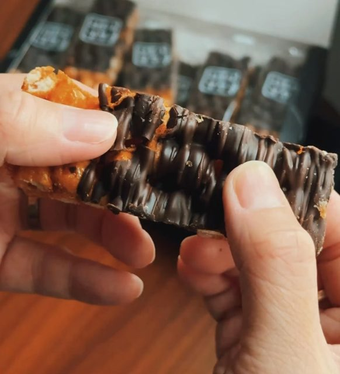

# 2026 釜山親子旅行手冊

**旅期**：2026/09/13 - 2026/09/20  
**成員**：2 位大人 + 1 位 2 歲幼童  
**旅行節奏**：每天保留午休、少拖行李、晚上盡量 21:00 前回飯店  

---

## 旅行重點

- 有幼童與行李時，換飯店日優先處理行李，再開始玩。
- 海雲台、南浦、松島、沙上各自成區，不要同一天來回拉太遠。
- 9/16 只搶到清沙浦 14:00 這班膠囊列車，上午改搭海岸列車去松亭玩沙吃飯；沙灘改傍晚玩，比中午涼爽。
- 9/17 札嘎其站置物櫃寄行李：站內兩處置物櫃在長廊兩端，回程走地下街那頭的 A 區較順路，行李箱優先選特大型。
- 9/19 是回國前一晚，定位為沙上休息與採買日。
- 9/20 從沙上搭釜山-金海輕軌到機場，路線短又穩。

## 住宿安排

| 日期 | 住宿 | 地址 / 叫車定位用 | 訂房平台 | 早餐 | 入住 / 退房 |
|---|---|---|---|---|---|
| 9/13-9/14 | Hotel Kyungsung | 26, Seomyeonmunhwa-ro, Busanjin-gu, Busan 47256 | Booking.com | 無 | 16:00～24:00／11:00 前 |
| 9/15-9/16 | UH Continental CenterPoint | 2-21, Dalmaji-gil, Haeundae-gu, Busan 48099 | 易遊網 | 含早餐（9/16、9/17 早上） | 15:00 後／11:00 前 |
| 9/17-9/18 | Elmomento Songdo | 9, Deungdae-ro, Seo-gu, Busan 49263 | Agoda | 無 | 16:00 後／11:00 前 |
| 9/19 | Elmomento Sasang Residence | 20, Saebyeok-ro 223beon-gil, Sasang-gu, Busan 46972（TheStayIaan） | Agoda | 無 | 16:00 後／11:00 前 |

- 入住/退房日期以住宿平台顯示的訂單為準：Hotel Kyungsung 9/13 入住、9/15 退房；UH Continental 9/15 入住、9/17 退房；Elmomento Songdo 9/17 入住、9/19 退房；Elmomento Sasang Residence 9/19 入住、9/20 退房。四間退房時間都是 11:00 前。

## 航班資訊

| 航段 | 日期 | 航班 | 機型 / 艙等 | 起飛 | 抵達 | 飛行時間 |
|---|---|---|---|---|---|---|
| 台北 → 釜山 | 9/13（日） | BX794 釜山航空 | 空中巴士 A321・經濟艙 H | TPE 桃園國際機場 T2 13:30 | PUS 釜山金海機場 17:05 | 2h35m |
| 釜山 → 台北 | 9/20（日） | BX793 釜山航空 | 空中巴士 A321・經濟艙 U | PUS 釜山金海機場 10:50 | TPE 桃園國際機場 T2 12:35 | 2h45m |

## 釜山 PASS 購買建議

**已選 BIG5 方案**（每人 65,000 韓元，選 2 個紫組＋3 個藍組，啟用後 180 天內有效，適合景點分散在不連續幾天的行程；比 24H/48H 時限型划算，因為這幾個景點分布在 Day3、Day4、Day6，時限型要買兩張才夠用）：

| 分組 | 用 PASS 的景點 | 單獨買票參考價／人 |
|---|---|---|
| 紫組（2 個） | Skyline Luge、BUSAN X the SKY | 約 28,000 / 27,000 韓元 |
| 藍組（3 個） | 海雲台海灘列車、松島海上纜車、釜山塔 | 約 12,000 / 17,000 / 12,000 韓元 |

以下兩個也是 PASS 景點，但票價低，建議現場付現、把 BIG5 名額留給上面較貴的項目：
- 松島龍宮雲橋（다릿돌전망대／용궁구름다리）：約 1,000 韓元／人，7 歲以下免費
- 太宗台다누비遊園列車：循環票約 4,000 韓元／人

全部單獨買票約需 194,000 韓元／2 大人；BIG5（130,000）＋上述兩筆現金（約 2,000）＝約 132,000 韓元，省下約 62,000 韓元。小孩（2 歲）在這幾個景點大多免費入場，應該不需要幫她另外買一張。

**領卡方式**（官方公告 2026-09-03）：線上買好的卡片版 PASS，9/3 起可在兩台 24 小時自助領卡機領取（中文介面，WOW PASS 代管）：

| 地點 | 位置 | 地址 | 本次用法 |
|---|---|---|---|
| 金海機場（建議） | 國際線 1F 4 號門旁 | 부산광역시 강서구 공항진입로 108 | Day 1 17:05 落地、出關後順路領，約 2 分鐘；同層有釜山觀光諮詢處人工櫃檯可備援 |
| 釜山站（備援） | KTX 釜山站 2F 7 號出口旁 | 부산광역시 동구 중앙대로 206 | 行程不經過釜山站，只在機場機台故障時當備案 |

流程：掃購買平台的訂單 QR → 機台吐卡 → 再感應卡片背面 QR 完成取卡。領卡**不會**啟用 180 天有效期，第一次在景點刷卡（Day 3 Skyline Luge）才開始算。只有在機台直接購買才需刷護照；上線初期系統可能不穩，刷不過就改人工櫃檯或線上客服（機台問題由 WOW PASS 客服處理）。記得先把訂單 QR 截圖存在手機。

**注意**：太宗台다누비遊園列車曾因安全檢查暫停營運（visitbusanpass.com 公告日 2026-07-13，改用免費接駁巴士替代，沒寫恢復日期），出發前務必到 visitbusanpass.com 或太宗台官網（taejongdae.bisco.or.kr）再次確認是否已恢復；若還在暫停，接駁巴士一樣不用推車爬坡，照 Day5 原計畫走即可。

## 親子旅行原則

- 上午安排戶外，下午保留室內或午睡。
- 每天至少留一段 60-120 分鐘回飯店休息。
- 餐廳時間可彈性，幼童餓了先便利商店或麵包墊胃。
- 推車可帶，但海東龍宮寺坡與階梯多，必要時改用背巾。
- 每天晚上先整理隔天用品：尿布、濕紙巾、水、點心、交通卡、護照。

---

# Day 1 - 9/13（日）出發與抵達釜山

**住宿**：Hotel Kyungsung  
**重點**：穩穩抵達、入住、吃晚餐，不排景點。

| 時間 | 行程 | 停留 | 備註 |
|---|---|---:|---|
| 10:00 | 家裡出發搭車 | 60 分 | 2 大 + 2 歲幼童，提早一點 |
| 11:00 | 抵達機場 / Check in | 90 分 | 托運行李、劃位、整理推車 |
| 12:30 | 機場午餐 / 換尿布 / 登機準備 | 60 分 | 不要排太緊 |
| 13:30 | 搭乘飛機 / 登機 | 215 分 | BX794 釜山航空・A321・經濟艙 H，TPE T2 起飛 |
| 17:05 | 落地 / 領行李 | 70 分 | PUS 釜山金海機場抵達，飛行時間 2h35m |
| 18:15 | 出關 / 簡單補給 | 30 分 | 買水、交通卡、整理行李；順路到 1F 4 號門旁的釜山 PASS 自助領卡機領卡（掃訂單 QR → 取卡 → 再掃卡背 QR；領卡不會啟用有效期） |
| 18:45 | 搭車到 Hotel Kyungsung | 60 分 | 輕軌+地鐵或行李多搭計程車 |
| 19:45 | Hotel Kyungsung Check in | 30 分 | 放行李、休息一下 |
| 20:15 | 橋村炸雞西面店 / 晚餐宵夜 | 75 分 | 可外帶回飯店 |
| 21:30 | 回飯店整理 / 洗澡 | 30 分 |  |
| 22:00 | 睡覺 |  |  |

**小提醒**：第一天成功標準很簡單：順利入住、吃到東西、小孩洗澡睡覺。

**雨天備案**：全天以機場、交通、飯店為主，沒有戶外行程，下雨不影響。

---

# Day 2 - 9/14（一）西面與田浦輕鬆日

**住宿**：Hotel Kyungsung  
**重點**：市民公園放電、田浦吃喝、西面室內逛街。

| 時間 | 行程 | 停留 | 備註 |
|---|---|---:|---|
| 09:00 | 晨喚 / 早餐 | 60 分 | 飯店附近簡單吃 |
| 10:00 | 釜山市民公園 | 120 分 | 適合幼童放電、散步 |
| 12:00 | 搭車到田浦咖啡街 | 30 分 | 從公園往田浦移動 |
| 12:30 | 田浦咖啡街 / 午餐 / 下午茶 | 120 分 | 咖啡推薦 Pot of Busan／FRUTO FRUTA，順路可逛選物店（見下方） |
| 14:30 | 回飯店午休 | 90 分 | 小孩午睡，爸媽也回血 |
| 16:00 | 樂天百貨 / 西面地下街 | 90 分 | 室內逛街，雨天也 OK |
| 17:30 | ARTBOX / BUTTER | 60 分 | 買小物、文具、玩具 |
| 18:30 | 松亭3代豬肉湯飯 | 90 分 | 晚餐 |
| 20:00 | 回飯店 Hotel Kyungsung |  | 早點休息 |

**備案**：如果下雨，市民公園可縮短，直接改成樂天百貨 + 西面地下街。

**田浦咖啡推薦**（依飲品／甜點是否含蛋標註，網路未列完整過敏原，建議現場再向店員確認）：
- Pot of Busan（부산 부산진구 전포대로209번길 26）：老宅咖啡廳，氣氛靜謐；必點無花果汽水，飲品類天然無蛋
- FRUTO FRUTA（부산 부산진구 전포대로224번길 28）：水果為主題，當季水蜜桃／芒果冰沙，飲品類天然無蛋
- Strut Coffee（부산 부산진구 동성로39번길 28）：2025 世界百大咖啡店，老屋改建、主打單品咖啡，甜點選項少
- fm coffee（부산 부산진구 전포대로199번길 26 1층）：水果派人氣店（草莓派／葡萄派），派皮通常含蛋，需現場確認

**田浦選物店推薦**（小清新風格文創選物）：
- object西面店（부산 부산진구 전포대로209번길 11）：文創選物指標店，杯盤餐具、吊飾、DIY 鑰匙圈，店面大好逛
- made by 西面店（부산 부산진구 전포대로199번길 34）：文具貼紙控必逛，手帳本、紙膠帶款式多
- AVIVERE Company（부산 부산진구 동천로 66 1층）：質感餐具、髮飾、鞋包，價格親民
- Slow Museum（부산 부산진구 서전로58번길 9 1층）：日系質感髮圈與飾品，氣氛優雅
- Stellaria／별꽃상점（부산 부산진구 전포대로 207 1층）：色彩繽紛選物店，餐具、娃娃、襪子款式特別

---

# Day 3 - 9/15（二）換飯店、龍宮寺、Luge

**住宿**：UH Continental 中心點酒店  
**重點**：先寄行李再往機張玩，傍晚回飯店午休。

| 時間 | 行程 | 停留 | 備註 |
|---|---|---:|---|
| 08:30 | 晨喚 / 整理行李 | 60 分 | Hotel Kyungsung 退房準備 |
| 09:30 | 搭車到 UH Continental | 40 分 | 先去海雲台寄放行李 |
| 10:10 | UH Continental 寄放行李 | 20 分 | 若不能 check-in，先寄放 |
| 10:30 | 搭車到海東龍宮寺 | 45 分 | 建議計程車 |
| 11:15 | 海東龍宮寺 | 90 分 | 樓梯多，慢慢走 |
| 12:45 | 고슬고슬가마솥밥 기장본점午餐 | 75 分 | 釜飯，有包廂＋海景，適合帶小孩安靜吃飯 |
| 14:00 | Skyline Luge 斜坡滑車 | 120 分 | 滿 85cm 可與大人共乘（另購 doubling ticket）；未滿 85cm 不能搭 |
| 16:00 | 搭車回 UH Continental | 40 分 | 小孩常在車上先睡著 |
| 16:40 | Check in / 午休補眠 | 100 分 | 當安靜休息時段，爸媽輪流整理行李 |
| 18:20 | 海雲台附近晚餐 | 90 分 | 不建議再拉遠 |
| 19:50 | 回飯店休息 |  | UH Continental |

**親子提醒**：Luge 未滿 85cm 不能搭，改樂天 Outlet 或飯店休息。體力有餘可加 Museum 1（Centum City，檔期至 2026/10/11，最後入場為閉館前 1 小時）。

**雨天備案**：龍宮寺可撐傘走，但階梯濕滑要放慢；Skyline Luge 官方僅雷雨／豪雨／颱風才會臨時關閉，小雨通常正常運行、只是賽道較滑，出發前看官網公告確認，若確定關閉改去國立釜山科學館（機張，室內親子景點）或樂天 Outlet 東釜山。

---

# Day 4 - 9/16（三）松亭海岸列車、膠囊列車、夜景

**住宿**：UH Continental 中心點酒店  
**重點**：上午搭海岸列車去松亭玩沙吃飯，中午折返清沙浦搭 14:00 膠囊列車回尾浦，傍晚沙灘接夕陽夜景。

| 時間 | 行程 | 停留 | 備註 |
|---|---|---:|---|
| 08:00 | 晨喚 | 30 分 | 今天不用趕特定場次，可以放慢 |
| 08:30 | 飯店早餐 | 45 分 | UH Continental 這天含早餐 |
| 09:15 | 走到尾浦站 | 20 分 | 飯店在달맞이길上，走到尾浦站不遠 |
| 09:35 | 搭海岸列車到松亭 | 25 分 | 用釜山 PASS 搭乘不用另外付費 |
| 10:00 | 松亭海水浴場 / 玩沙散步 | 60 分 | 長 1.2km 大沙灘，坡緩水淺，適合小孩玩沙 |
| 11:00 | 송정밥집본점午餐 | 75 分 | 韓式家常套餐，安靜好坐；非海鮮選項多，適合海鮮過敏 |
| 12:15 | 搭海岸列車回清沙浦 | 15 分 | 松亭到清沙浦比到尾浦近 |
| 12:30 | 청사포항 / 다릿돌전망대散步 | 60 分 | 免費天空步道，尾端玻璃地板可看海；純散步銜接下面的膠囊列車 |
| 13:30 | 清沙浦站月台排隊 | 30 分 | 自由座先搶先贏，面海長椅坐第一排視野最好；提早排隊小小孩才坐得住 |
| 14:00 | 海雲台膠囊列車（清沙浦→尾浦） | 30 分 | 只搶到這班次的票，方向是清沙浦回尾浦；膠囊列車不含 PASS |
| 14:30 | 回飯店稍作休息 | 45 分 | 尾浦到飯店很近，讓小孩緩一下再去沙灘 |
| 15:15 | 海雲台沙灘 | 90 分 | 傍晚玩沙比中午涼爽；飯店旁就是沙灘，不用移動 |
| 17:00 | BUSAN X the SKY | 80 分 | 沙灘到 LCT 約 10 分路程；看夕陽接夜景 |
| 18:20 | 移動到 THE BAY 101 | 20 分 | 從 LCT 跨到東白島，建議計程車 |
| 18:40 | THE BAY 101 | 50 分 | 夜景散步、拍照 |
| 19:30 | Outdark Chicken House 炸雞 | 90 分 | 晚餐 / 宵夜；⚠️ 查無 Outdark（아웃닭）海雲台分店，釜山只有西面／하단／부산대／동래店，建議改 PURADAK 海雲台店（해운대로483번길 1-7） |
| 21:00 | 回飯店 UH Continental |  | 休息 |

**訂票提醒**：藍線膠囊列車只搶到清沙浦 14:00 這班（方向清沙浦→尾浦），提早 15-20 分到月台排隊才能搶到面海長椅第一排；膠囊列車不含釜山 PASS。海岸列車（尾浦-청사포-松亭）全程可用 PASS。

**過敏提醒**：小孩海鮮過敏，青沙浦幾乎全是海鮮／烤貝店，午餐已改到松亭（송정밥집본점，非海鮮選項多）；青沙浦這段只安排免費的다릿돌전망대散步，不吃東西。

**動線提醒**：這天原本排 Sea Life 水族館，因為改走海岸列車環尾浦-松亭-清沙浦這條線、又鎖定清沙浦 14:00 膠囊列車，整個上午到早下午都排滿，水族館拿掉改列備案（雨天可用）。海岸列車尾浦-松亭段約 25 分、松亭-清沙浦段約 15 分（PASS 皆可用）；清沙浦站與다릿돌전망대同一條路，步行可到。沙灘改到傍晚玩（比中午涼爽），就在飯店旁不用額外移動；BUSAN X the SKY（LCT）到 THE BAY 101（東白島）中間隔著整個海雲台，已補上約 20 分計程車轉場時間。

**雨天備案**：這天幾乎整天在戶外（玩沙、전망대散步、沙灘、THE BAY 101 夜景散步），是全程雨天風險最高的一天；建議整段改成 SEA LIFE 釜山水族館（海雲台，室內親子雨天主力備案），BUSAN X the SKY 本身就是室內觀景點不受影響；海岸列車車廂有遮雨，但沙灘玩沙與청사포다릿돌전망대這類戶外散步段建議縮短或跳過。

---

# Day 5 - 9/17（四）太宗台與松島入住

**住宿**：El Momento Songdo  
**重點**：札嘎其站置物櫃寄行李，搭 Uber 去太宗台。

| 時間 | 行程 | 停留 | 備註 |
|---|---|---:|---|
| 09:00 | 晨喚 / 整理行李 | 60 分 | UH Continental 退房；這天含早餐，退房前先吃 |
| 10:00 | 搭車到札嘎其站 | 60 分 | 含拖行李移動緩衝 |
| 11:00 | 札嘎其站置物櫃寄放行李 | 20 分 | 站內兩處置物櫃在長廊兩端；回程走地下街那頭的 A 區較順路，行李箱優先選特大型 |
| 11:20 | 搭 Uber 到太宗台 | 25 分 | 距離比原本的海洋博物館遠，實際時間建議上車前用 Uber 估算；行李已寄放，輕裝移動 |
| 11:45 | 太宗台（다누비遊園列車） | 90 分 | 環園賞展望台、燈塔；2 歲以下通常可坐大人腿上免票，全程坐車不用推車爬坡；每週一公休（本日週四不受影響）；也可用 PASS 但循環票只要約 4,000 韓元，現場付現比較划算，BIG5 名額留給更貴的項目 |
| 13:15 | 搭 Uber 回札嘎其 / BIFF 廣場 | 25 分 | 距離比原本的海洋博物館遠，實際時間建議上車前用 Uber 估算 |
| 13:40 | 札嘎其市場 / BIFF 廣場午餐 | 90 分 | 太宗台比甘川洞遠，時間比原計畫晚一些，正常吃就好 |
| 15:10 | 取行李 | 20 分 | 回札嘎其站取行李——用地下街那頭的 A 區置物櫃 |
| 15:30 | 搭車到 El Momento Songdo | 25 分 | 建議計程車 |
| 15:55 | Check in / 午休補眠 | 155 分 | 把甘川洞省下的時間留給小孩多睡，行李放好後不用急著出門 |
| 18:30 | 松島附近晚餐 / 海邊散步 | 150 分 | 不再拉回南浦；吃完沿松島海邊慢慢散步回飯店 |
| 21:00 | 回飯店休息 |  | El Momento Songdo |

**行李策略**：若札嘎其站特大型櫃滿了，改先寄 El Momento Songdo 飯店，再去太宗台。

**早餐提醒**：這天是 UH Continental 最後一天含早餐，11:00 前退房，退房前記得先吃。

**雨天備案**：다누비遊園列車／接駁巴士都有遮雨頂棚可正常搭乘，但下車在展望台、燈塔散步的段落會淋濕；建議改去國立海洋博物館（影島，室內親子展覽，跟太宗台同一區，順路好接）。札嘎其市場／BIFF廣場多為有頂棚拱廊，受雨天影響較小。

**變更說明**：原本安排的甘川洞文化村坡度與階梯多，推車移動太累，先改成國立海洋博物館，後來又改成太宗台——搭다누비遊園列車環園（展望台、燈塔、太宗寺），2 歲以下小孩通常可坐大人腿上免票，全程坐車不用推車爬坡。太宗台比國立海洋博物館離札嘎其遠一些，往返都搭 Uber，實際時間建議上車前用 App 估算。甘川洞文化村與國立海洋博物館仍保留在備用景點清單中，之後想去可自由安排。太宗台다누비遊園列車每週一公休，若之後改期要避開週一。

**⚠️ 出發前確認**：다누비遊園列車曾因安全檢查暫停營運（visitbusanpass.com 公告日 2026-07-13，改用免費接駁巴士替代，沒寫恢復日期），出發前務必到 visitbusanpass.com 或太宗台官網（taejongdae.bisco.or.kr）再次確認是否已恢復；若還在暫停，接駁巴士一樣不用推車爬坡，照原計畫走即可。

---

# Day 6 - 9/18（五）松島與南浦洞

**住宿**：El Momento Songdo  
**重點**：上午松島海邊，下午南浦洞逛買，晚上釜山塔。

| 時間 | 行程 | 停留 | 備註 |
|---|---|---:|---|
| 09:00 | 晨喚 | 60 分 |  |
| 10:00 | 松島沙灘 / 挖沙 / 海邊散步 | 90 分 | 早上比較不熱 |
| 11:30 | 松島纜車 | 90 分 | 可接松島龍宮天空步道 |
| 13:00 | 松島龍宮天空步道 | 60 分 |  |
| 14:00 | 豚笑南浦店 | 90 分 | 從松島移動到南浦吃午餐 |
| 15:30 | 國際市場 - 재미완구 玩具店 | 90 分 | 玩具、雜貨 |
| 17:00 | 南浦洞商圈 / 光復路 | 90 分 | 藥妝、伴手禮、零食 |
| 18:30 | 海豚豆腐鍋 | 60 分 | 晚餐 |
| 19:30 | 龍頭山公園 & 釜山塔 | 90 分 | 看夜景 |
| 21:00 | 回 El Momento Songdo |  |  |

**親子提醒**：這天逛街多，下午可以穿插咖啡廳或百貨休息。

**雨天備案**：松島沙灘挖沙、용궁구름다리這類戶外段雨天建議跳過或縮短；松島纜車小雨通常照常營運，強風雷雨才會停駛，以現場公告為準。改成室內的釜山電影體驗博物館或釜山近代歷史館（都在南浦，可直接替換逛街段），或 Arte Museum 釜山（影島）；釜山塔本身電梯上樓看夜景不受影響，只有龍頭山公園戶外段會淋濕。

---

# Day 7 - 9/19（六）沙上休息與採買日

**住宿**：Elmomento Sasang Residence  
**重點**：移動到沙上、午睡、採買、早點休息。

| 時間 | 行程 | 停留 | 備註 |
|---|---|---:|---|
| 09:00 | 晨喚 / 慢慢整理行李 | 75 分 | 小孩出門前多留緩衝 |
| 10:15 | 計程車前往 Elmomento Sasang Residence | 45 分 | 地址：20, Saebyeok-ro 223beon-gil, Sasang-gu |
| 11:00 | 飯店寄放行李 / Check in | 30 分 | 不能入住就先寄放 |
| 11:30 | 陝川一流豬肉湯飯 | 70 分 | 午餐 |
| 12:40 | 回飯店 / 午休 | 120 分 | 讓小孩睡一下 |
| 14:40 | 沙上附近超市 / 商圈採買 | 90 分 | 買隔天早餐、零食、伴手禮 |
| 16:10 | 咖啡廳或回飯店休息 | 80 分 | 看小孩狀態彈性 |
| 17:30 | 崔脊骨醒酒湯 | 70 分 | 晚餐早點吃 |
| 19:00 | 回飯店整理行李 | 60 分 | 隔天機場用品先準備 |
| 20:30 | 休息 / 睡覺 |  | 隔天早起 |

**交通建議**：松島到 Elmomento Sasang Residence 有行李與幼童，計程車最省力。

**雨天備案**：這天本來就以飯店、餐廳、超市為主，室內活動居多；下午的採買行程可整段改到 Renecite（沙上購物商場），不影響原計畫。

---

# Day 8 - 9/20（日）回程日

**重點**：沙上搭釜山-金海輕軌到機場，保留幼童緩衝。

| 時間 | 行程 | 停留 | 備註 |
|---|---|---:|---|
| 06:30 | 晨喚 | 45 分 | 大人先整理，小孩慢慢醒 |
| 07:15 | 簡單早餐 / 便利商店補給 | 35 分 | 水、麵包、小孩點心 |
| 07:50 | 退房 / 整理行李 | 20 分 | 護照、登機資料、推車 |
| 08:10 | 步行到沙上站 | 15 分 | 看飯店位置調整 |
| 08:25 | 搭釜山-金海輕軌到機場站 | 15 分 | 沙上到機場很近 |
| 08:40 | 抵達金海機場 / Check in | 85 分 | 國際線 + 幼童，時間夠 |
| 10:05 | 安檢 / 出境 / 登機口 | 30 分 | 換尿布、上廁所 |
| 10:35 | 登機準備 | 15 分 |  |
| 10:50 | 搭乘飛機 | 105 分 | BX793 釜山航空・A321・經濟艙 U，PUS 起飛 |
| 12:35 | 落地 / 領行李 | 60-90 分 | TPE 桃園國際機場 T2 抵達，飛行時間 2h45m |

**保守版**：若想更安心，整體往前 15 分鐘出門。

---

## 交通筆記

- 機場到西面：輕軌 + 地鐵可行；行李多或小孩累可計程車。
- 西面到海雲台換飯店：先到 UH Continental 寄行李，再去景點。
- 海雲台到札嘎其站：預留 60 分鐘，含行李與轉乘緩衝。
- 札嘎其到松島：取行李後建議計程車。
- 松島到 Elmomento Sasang Residence：建議計程車。
- 沙上到金海機場：釜山-金海輕軌最順。

## 行李與寄放策略

- 9/15：Hotel Kyungsung 退房後，先到 UH Continental 寄放行李。
- 9/17：札嘎其站置物櫃寄行李，搭 Uber 去太宗台。站內有 A（101~號，靠地下街）、B（201~號，靠토성方向）兩處置物櫃，回程走地下街那頭的 A 區較順路。基本 4 小時：小 2,000／中 3,000／大 4,000／特大 5,000 韓元（實際費率請以現場機台為準）；官方統計全站合計特大 45／大 2／中 28／小 11 格，行李箱優先選特大型。
- 9/19：抵達 Elmomento Sasang Residence 後先寄行李或 check-in。
- 9/20：前一晚先把機場用品集中：護照、登機資料、推車、尿布、濕紙巾、點心。

## 幼童用品清單

- 護照、健保/旅平險資料
- 尿布、濕紙巾、替換衣物
- 小水壺、零食、麵包
- 常備藥、退燒藥、溫度計
- 防曬、帽子、薄外套
- 推車或背巾
- 小玩具、貼紙書、安撫物
- 飛機用點心與小活動

## 每日出門前檢查

- 手機、行動電源、充電線
- 交通卡 / 現金 / 信用卡
- 護照或護照影本
- 小孩水、點心、尿布、濕紙巾
- 當日票券與預約截圖
- 雨具或防曬用品

## 常用韓文

| 中文 | 韓文 | 羅馬拼音 |
|---|---|---|
| 置物櫃 | 물품보관함 | mul-pum-bo-gwan-ham |
| 廁所 | 화장실 | hwa-jang-shil |
| 計程車 | 택시 | taek-si |
| 機場 | 공항 | gong-hang |
| 小孩 | 아이 | a-i |
| 水 | 물 | mul |
| 不辣 / 請不要辣 | 안 맵게 해주세요 | an maep-ge hae-ju-se-yo |
| 請幫忙 | 도와주세요 | do-wa-ju-se-yo |
| 含蛋或海鮮嗎？ | 계란이나 해산물 들어가나요? | gye-ran-i-na hae-san-mul deul-eo-ga-na-yo |
| 蛋過敏 | 계란 알레르기 있어요 | gye-ran al-le-reu-gi i-sseo-yo |
| 海鮮過敏 | 해산물 알레르기 있어요 | hae-san-mul al-le-reu-gi i-sseo-yo |

## 緊急聯絡

- 韓國緊急電話：救護／消防 **119**、警察 **112**（手機沒訊號也能撥）。
- 韓國觀光公社 24 小時中文熱線：當地直撥 **1330**（台灣門號漫遊撥 +82-2-1330），旅遊諮詢、客訴、即時翻譯協助。
- 駐釜山台北代表處：辦公室 **+82-51-463-7965**（上班時間）；急難專線 **+82-10-9080-2761**（限車禍、搶劫等緊急事件）。地址：釜山中區中央大路 70，東遠大樓 9 樓。
- 外交部旅外國人急難救助：在韓國撥 **001-800-0885-0885**（免付費）；台灣家人可撥 0800-085-095 聯繫外交部緊急聯絡中心。

## 附近醫院（幼兒緊急就醫，24 小時急診）

以下依住宿地點列出最近、確認有 24 小時急診室（응급실／응급의료센터）的大型綜合醫院。地址為韓文道路名地址，可直接給計程車司機看。距離為概估車程，實際依路況調整。

**西面（Hotel Kyungsung，9/13-9/14）**
- **仁濟大學釜山白病院 Inje University Busan Paik Hospital**（인제대학교 부산백병원）
  - 地址：부산광역시 부산진구 복지로 75（개금동）
  - 代表電話：051-890-6114；急診（응급의료센터）直線：051-890-5995
  - 24 小時急診：已確認（醫院官網明列 24 小時應急醫療服務）
  - 距離：車程約 10 分鐘內（近 2 號線開金站）
  - 來源：[醫院官網-電話號碼安內](https://www.paik.ac.kr/busan/user/telInfo/list.do?menuNo=800080)、[醫院官網-應急診療](https://www.paik.ac.kr/busan/user/contents/view.do?menuNo=800085)

**海雲台（UH Continental CenterPoint，9/15-9/16）**
- **仁濟大學海雲台白病院 Inje University Haeundae Paik Hospital**（인제대학교 해운대백병원）
  - 地址：부산광역시 해운대구 해운대로 875（좌동）
  - 代表電話：051-797-0100（未查到獨立急診分機，撥代表號會轉接急診）
  - 24 小時急診：已確認（醫院為權域急診醫療中心，365 天 24 小時運作）
  - 距離：車程約 10-15 分鐘（飯店在달맞이길東側，醫院在좌동內陸，海雲台旺季易塞車，請預留彈性）
  - 來源：[醫院官網-電話號碼安內](https://www.paik.ac.kr/haeundae/user/telInfo/list.do?menuNo=500033)、[醫院公告-權域急診醫療中心再指定](https://www.paik.ac.kr/haeundae/user/bbs/BMSR00040/view.do?menuNo=500061&boardId=31996)

**松島／西區（Elmomento Songdo，9/17-9/18）**
- **高神大學校福音醫院 Kosin University Gospel Hospital**（고신대학교복음병원）
  - 地址：부산광역시 서구 감천로 262（암남동）
  - 代表電話：051-990-6114；24 小時急診醫療中心：051-990-6200
  - 24 小時急診：已確認（醫院官網「응급진료안내」頁面列出 24 小時急診服務）
  - 距離：車程約 10 分鐘內（암남동與松島同屬西區，地緣相鄰）
  - 來源：[醫院官網-應急診療安內](https://kosinmed.or.kr/02medical/medical06.htm)、[醫療資訊網彙整](https://mobile.hidoc.co.kr/find/result/view/H0000152244)

**沙上（Elmomento Sasang Residence，9/19）**
- **좋은삼선병원 Good Samseon Hospital**（종합병원，急診 20 床）
  - 地址：부산광역시 사상구 가야대로 326（주례동）
  - 代表電話：051-322-0900；急診室直線：051-310-9109
  - 24 小時急診：已確認（醫院設有應急醫療中心，365 天 24 小時由急診專科醫師駐診）
  - 距離：車程約 15-20 分鐘（2 號線냉정역附近，距沙上站約 4 站，非最近但為完整綜合醫院）
  - 來源：[醫院官網-應急醫療中心](https://www.samsun.or.kr/samsun/contents/view.do?mId=186)、[醫療資訊網彙整](https://mobile.hidoc.co.kr/find/result/view/H0000152471)
- **備選（距離較近，但為骨科／內科特化醫院）：서부산센텀병원 West Busan Centum Hospital**
  - 地址：부산광역시 사상구 새벽로 226（괘법동，與飯店同一帶，沙上站步行可達範圍）
  - 代表電話：1644-5530；急診室直線：051-329-3119
  - 24 小時急診：已確認可 24 小時看診，但醫院主打骨科創傷與內科，非全科綜合醫院，發燒、腸胃炎等一般幼兒急症建議優先考慮좋은삼선병원或直接撥 119 由救護車判斷送診
  - 來源：[醫院官網-應急室利用安內](https://wbch.co.kr/main/contents.do?idx=5870)

**查證方式**：以上均以醫院官方網站的電話號碼頁／應急診療頁為主要依據，並以醫療資訊入口網站（하이닥等）交叉核對地址與電話一致性。若臨時需要更即時的清單，可用韓國中央急診醫療中心 E-GEN 官網（e-gen.or.kr）依目前定位查詢即時開放中的急診室。

---

## 出發前確認

- 藍線膠囊列車訂票與時段。
- ✅ 已確認：Skyline Luge 滿 85cm 可與大人共乘（另購 doubling ticket）、未滿 85cm 不能搭——出發前記得量小孩身高。
- ✅ 已確認：Museum 1 檔期「Again, Übermensch」至 2026/10/11，平日 10:00-19:00、最後入場閉館前 1 小時（已改列 Day 3 體力備案）。
- ✅ 已確認：札嘎其站置物櫃分 A（近地下街）、B（近토성方向）兩處，回程走地下街那頭用 A 區較順路；行李箱優先選特大型（全站約 45 格）；備案為先寄 El Momento Songdo。
- ✅ 已確認：四個住宿點鄰近 24 小時急診醫院（西面-釜山白病院、海雲台-海雲台白病院、松島-高神大福音醫院、沙上-좋은삼선병원），地址電話見「附近醫院」章節。
- 各飯店是否可提前寄放行李。
- 航班、行李額、推車托運規定。

---

## 叫外送到飯店（小孩累了／下雨用）

外國人怎麼叫：**배달의민족（Baemin）** 2026/8 起可用海外手機號碼收簡訊驗證註冊，海外信用卡或 Apple Pay 付款；送餐地址貼「住宿」的韓文地址＋房號，備註「호텔 로비에 놔주세요」（放大廳）最省事，或直接請櫃檯代叫。連鎖炸雞在 쿠팡이츠 也有。

查證過有外送的店（其餘多為只能外帶）：

| 區域 | 店家 | 備註 |
|---|---|---|
| 西面 | 橋村炸雞西面店（교촌치킨 서면점） | Day 1 晚餐，連鎖，배민／쿠팡이츠；蜂蜜／原味不辣 |
| 西面 | PURADAK CHICKEN 西面전포점 | 連鎖，招牌偏辣、幫小孩點原味 |
| 海雲台 | PURADAK CHICKEN 海雲台店 | 連鎖，營業到 24:00，可叫到 UH Continental |
| 松亭 | 수변최고 돼지국밥 송정점 | 豬肉湯飯，非海鮮 |
| 機張 | 王大骨馬鈴薯豬骨湯 機張店 | 營業到凌晨 4 點；店內有兒童遊戲區 |
| 南浦 | 南浦雪濃湯（남포설렁탕） | 24 小時，牛骨湯 |
| 釜山站 | 元祖冷麵1984 | 有外送，但評論一致說現場吃較好 |
| 沙上 | 밀면촌 | 只到 15:00，午餐時段叫 |

沒有外送但可外帶回飯店：極東豬肉湯飯（海雲台，店內有兒童椅）、安木西面店（有兒童椅）、陝川一流豬肉湯飯、海豚豆腐鍋、崔脊骨醒酒湯（1 人份也可外帶）。

## 購物清單

依類別分組：彩妝／保養／髮品／食品伴手禮。彩妝、保養、髮品**全部在 OLIVE YOUNG 買得到**，不用特地找專門店；Fwee、Torriden、UNOVE、Longtake 這幾個小眾品牌建議挑大一點的分店才貨齊（見下方「行程沿路的大型分店」，這 4 間都已經是規模較大的）。

| 圖片 | 類別 | 品牌 | 品項 | 韓文品名（可直接給店員看） | 備註 |
|---|---|---|---|---|---|
|  | 彩妝 | BANILA CO | 控油定妝蜜粉餅 | 바닐라코 프라임 프라이머 피니쉬 파우더 팩트 | |
|  | 彩妝 | Fwee | 唇頰兩用布丁膏 | 퓌 립앤치크 블러리 푸딩팟 | 2025 올리브영 어워즈 컨투어링部門第一名 |
|  | 保養 | MEDIHEAL | 集中護理舒緩棉片 | 메디힐 마데카소사이드 패드 | |
|  | 保養 | MEDIHEAL | N.M.F面膜 | 메디힐 더 엔엠에프 앰플 마스크 | |
|  | 保養 | Torriden | 玻尿酸精華 | 토리든 다이브인 세럼 | 올리브영長銷冠軍款，累積賣破 1300 萬瓶 |
|  | 保養 | ISOI | 保加利亞玫瑰護理精華 | 이소이 불가리안 로즈 블레미쉬 케어 세럼 | |
|  | 髮品 | UNOVE | 深層受損修護髮膜 | 어노브 딥 데미지 리페어 헤어 마스크 | 連續 4 年올리브영髮膜銷售冠軍 |
|  | 髮品 | Longtake | 檀香強效護髮油 | 롱테이크 샌달우드 인텐시브 헤어오일 | |

**行程沿路的大型 OLIVE YOUNG 分店**（規模較大，貨較齊，以上彩妝／保養／髮品都可以在下面任一間買齊）：

| 地區 | 分店 | 位置 | 地址 |
|---|---|---|---|
| 西面 | OLIVE YOUNG 西面站前店 | 西面站 10 號出口正對面，兩層樓 | 부산광역시 부산진구 중앙대로 686 |
| 海雲台 | OLIVE YOUNG 海雲台站店 | 海雲台站附近 | 부산광역시 해운대구 구남로8번길 7-5 |
| 南浦 | OLIVE YOUNG 南浦 Town | 2026 新開幕釜山最大旗艦店，4 層樓約 900 坪，就在 BIFF 廣場旁 | 부산광역시 중구 비프광장로 40 |
| 沙上 | OLIVE YOUNG 沙上 Apple Outlet 店 | 西部巴士客運站旁 Apple Outlet 地下 1 樓，兩層規模 | 부산광역시 사상구 사상로 201 |

### 食品伴手禮

| 圖片 | 品牌 | 品項 | 韓文品名 | 哪裡買 |
|---|---|---|---|---|
|  | CU | 杜拜巧克力Q餅 | 두바이 쫀득 찹쌀떡 | CU 超商限定新品（2025/10 上市後常缺貨，看到建議先買），沿路任何一家 CU 都有 |
|  | IMINT | 咖啡糖 | 아이민트 에스프레소 자일리톨 커피캔디 | CU 超商限定，咖啡豆造型糖，含木糖醇，沿路任何一家 CU 都有 |
|  | 農心 | 蝦味條 黑松露風味 | 농심 새우깡 블랙 | 이마트 사상店 |
|  | 好麗友 | 陽光波浪玉米脆片 | 오리온 태양의 맛 썬 | 이마트 사상店（現在架上常見辣味版，原味單獨包裝較少見，可請店員確認） |
|  | 好麗友 | 生洋芋片 | 오리온 포카칩 | 이마트 사상店 |
|  | No Brand | 紫薯洋芋片 | 노브랜드 자색고구마칩 | 이마트 사상店（이마트自有品牌，一般超商買不到） |
|  | 好麗友 | 鯛魚燒蛋糕 | 오리온 참붕어빵 | 이마트 사상店 |
|  | CROWN | 鮮奶油鬆餅 | 크라운 생크림와플 | 이마트 사상店（官方品名是버터와플/奶油鬆餅，同一款） |
|  | Binch | 巧克力餅乾 | 롯데 빈츠 | 이마트 사상店 |
|  | Market O | 布朗尼蛋糕 | 마켓오 리얼 브라우니 | 이마트 사상店 |
|  | LOVELY GANGJUNG | 手工江米條 | 러블리강정 강정 | LOVELY GANGJUNG 海雲台店（只有這間實體店，不是超商／超市貨）；純米糖膠製、甜度低不黏牙，常溫可放不用冷藏 |

**이마트 사상店**：부산광역시 사상구 광장로 17（跟 Day7「沙上附近超市／商圈採買」同一區，也離 OLIVE YOUNG 沙上分店很近）。一般零食類（農心／好麗友／樂天／CROWN）跟 No Brand 自有品牌都找得到，一次買齊。

**LOVELY GANGJUNG（러블리강정）海雲台店**：부산광역시 해운대구 우동1로38번길 10（海理團路上的粉紅色店面，走到海雲台站約 5 分；Day 3－4 住 UH Continental 時順路買）。
